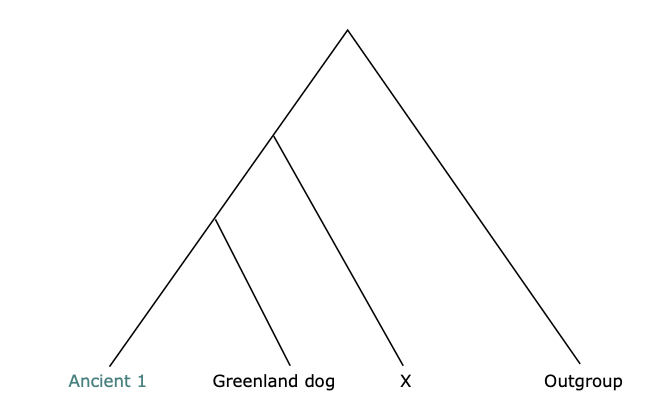
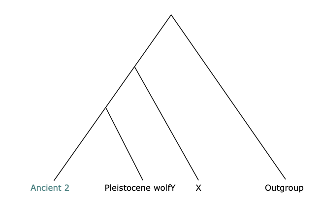
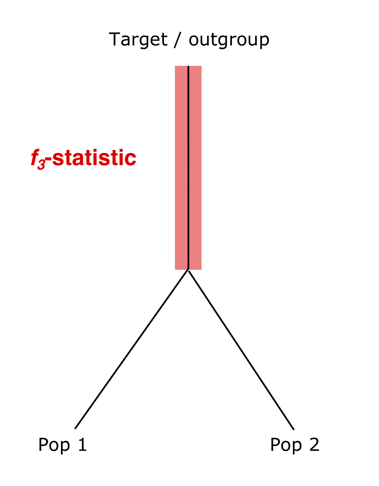

## *f*-statistics


Today we will use the SNP dataset that we generated yesterday to estimate outgroup $f_3$-statistics and *D*-statistics to test for treeness and gene-flow between the reference samples and our ancient canid.

### Outline:

* Incorporate an outgroup to our dataset
* Pre-compute allele frequencies using ```FrAnTK``` <sup>2</sup> 
* *D*-statistics 
* *D*-statistics to test for treeness 
* *D*-statistics to test for treeness in our mystery samples
* *D*-statistics to test for gene-flow between the American wolf and coyote 
    + using ```FrAnTK``` <sup>2</sup> 
    + using ```ANGSD``` <sup>3</sup>
* Estimae $f_3$-statistics to locate the sample closest to our mystery sample 
   + using ```FrAnTK```


### Interactive node

We will use an interactive node in mjolnir to run the exercises throughout the course, so you always start by opening an interactive session in the server. Follow the steps below.

```{bash, eval = FALSE}
# First log in to the server (remember to change ku_username for your username)
ssh ku_username@mjolnirgate.unicph.domain

# first request one CPU using salloc like this:
salloc --partition=cpuqueue --nodes=1 -D `pwd` --mem-per-cpu 5250 --ntasks-per-node=1 -t 1000 --account=teaching --reservation=aDNA_PHD_course

# once the job has been allocated, you can login to the node with srun like this:
srun --pty -n 1 -c 1 bash -i
```

Now, let's create a directory for the $f$-statistics exercises:
```{bash, eval = FALSE}
# remember you change for you username
username="write_your_username"
directoryGF="/projects/course_1/people/${username}/fstats/"
mkdir -p $directoryGF

# go to the directory
cd $directoryGF
```

----------------------------------------------


### Add an outgroup to the SNP dataset

The exercises for today, require that we have an outgroup in our SNPs dataset, so we will start by adding 3 golden jackal samples (*Canis aureus*) and a 7 coyotes (*Canis latrans*) to the PLINK files that we created for yesterday. 

Define some paths and sample names:

```{bash, eval=FALSE}
# Here we are using the SNP dataset that contain the full name of the scaffolds, since we will be manipulating the files with plink
PLINKDS="/projects/course_1/people/$username/ExploratoryAnalyses/wolves_mergedTv"
OUTGROUP="/projects/course_1/people/clx746/Data/Outgroups_sites"
```

First, take a look at the FAM file of the outgroups:

```{bash, eval=FALSE}
head $OUTGROUP.fam
```
```
Coyote CoyoteAlabama 0 0 0 1
Coyote CoyoteAlaska 0 0 0 1
Coyote CoyoteCal 0 0 0 1
Coyote CoyoteFlorida 0 0 0 1
GoldenJackal GoldenJackal_CN232 0 0 0 1
Coyote CoyoteIllinois 0 0 0 1
Coyote CoyoteMexico 0 0 0 1
Coyote CoyoteMissouri 0 0 0 1
GoldenJackal GoldenJackal 0 0 0 1
GoldenJackal SyrianJackal 0 0 0 1
```

<span style="color: purple;"> **Question:** </span>  Do you see anything different compared to the PLINK files we worked with yesterday?

<details>
<summary> <b>Show answer</b> </summary>

We are grupping some samples into populations/groups. We can see this in the first column of the FAM file: all of the 7 coyote samples have the same population name in the first column, and the same for all 3 golden jackals.

</details>

Now, let's use `plink`<sup>4</sup> to add the outgroup to the previous SNP dataset:
```{bash, eval=FALSE}
# load plink
module load plink/1.9.0

# merge the two files:
plink --bfile $PLINKDS --bmerge $OUTGROUP --out wolves_rand_out --make-bed  --allow-extra-chr --allow-no-sex
```
Check the parameters we are using! Do you remember what *-bmerge* is for?

Finally, we want to pool some of the dogs and wolves from the same locations together into populations/groups. We will do that by editing the first column of the FAM file we just created. 

Here is an option with on how to do it using ```perl```, but you could also use ```vi```, ```nano```, or any other editor you prefer. You could also download the file to your computer, edit it with a text editor and upload again (feel free to try any option you want). 

```{bash, eval=FALSE}
# First create a copy of the original file, so that we can go back to it if needed:
cp wolves_rand_out.fam wolves_rand_out_old.fam

# Then edit the file with perl:
cat wolves_rand_out_old.fam |perl -pe 's/Wolf_Israeli Wolf_Israeli/Wolf_Israel Wolf_Israeli/g;' |perl -pe 's/Wolf_Israeli2 Wolf_Israeli2/Wolf_Israel Wolf_Israeli2/g;' |perl -pe 's/Wolf_Chinese Wolf_Chinese/Wolf_China Wolf_Chinese/g;' |perl -pe 's/Wolf_Chinese2 Wolf_Chinese2/Wolf_China Wolf_Chinese2/g;' |perl -pe 's/Dog_SibHusky1 Dog_SibHusky1/Dog_SibHusky Dog_SibHusky1/g;' |perl -pe 's/Dog_SibHusky2 Dog_SibHusky2/Dog_SibHusky Dog_SibHusky2/g;' > wolves_rand_out.fam
```

Check how the FAM file looks before and after for some of the samples we pooled together:

```{bash, eval=FALSE}
# Before:
grep -e Wolf_Chin -e Wolf_Israel -e SibHusky wolves_rand_out_old.fam 
```
```
Dog_SibHusky1 Dog_SibHusky1 0 0 0 1
Dog_SibHusky2 Dog_SibHusky2 0 0 0 1
Wolf_Chinese Wolf_Chinese 0 0 0 1
Wolf_Chinese2 Wolf_Chinese2 0 0 0 1
Wolf_Israeli Wolf_Israeli 0 0 0 1
Wolf_Israeli2 Wolf_Israeli2 0 0 0 1
```

```{bash, eval=FALSE}
# After:
grep -e Wolf_Chin -e Wolf_Israel -e SibHusky wolves_rand_out.fam 
```
```
Dog_SibHusky Dog_SibHusky1 0 0 0 1
Dog_SibHusky Dog_SibHusky2 0 0 0 1
Wolf_China Wolf_Chinese 0 0 0 1
Wolf_China Wolf_Chinese2 0 0 0 1
Wolf_Israel Wolf_Israeli 0 0 0 1
Wolf_Israel Wolf_Israeli2 0 0 0 1
```

------------------------------------------


### Precompute allele frequencies using FrAnTK

For today's exercises we will be using ```FrAnTK```, which uses pre-computed allele frequencies for the population/groups in our PLINK files. ```FrAnTK``` has many different tools that we can use to explore allele sharing patterns and test specific hypotheses about gene-flow, it can also be used to incorporate BAM files into SNP panels and to create the input file required by ```TreeMix```, you can read more about it [here](https://github.com/morenomayar/FrAnTK).


Start by creating a CLUST file that contains information about the sample's name, population and ploidy. We need a table with four columns *tab* separated with the following information:

1. Population name (first column of the FAM file)
2. Sample name (second column of the FAM file)
3. Population name
4. Ploidy of the sample (1 = haploid, 0 (or any other number) = diploid)

(For the fourth column we will use the last column of the FAM file, since we know it is a 1 and all of our samples are haploid, but remember to change this depending on the  ploidy of your samples.)

```{bash, eval=FALSE}
paste -d "\t" <(cut -f 1 -d " " wolves_rand_out.fam) <(cut -f 2 -d " " wolves_rand_out.fam) <(cut -f 1 -d " " wolves_rand_out.fam) <(cut -f 6 -d " " wolves_rand_out.fam) > clust_file
```

Check how the CLUST file looks like:
```{bash, eval=FALSE}
head clust_file
```
```
Coyote	CoyoteAlabama	Coyote	1
Coyote	CoyoteAlaska	Coyote	1
Coyote	CoyoteCal	Coyote	1
Coyote	CoyoteFlorida	Coyote	1
Coyote	CoyoteIllinois	Coyote	1
Coyote	CoyoteMexico	Coyote	1
Coyote	CoyoteMissouri	Coyote	1
Dog_AlaskanHusky	Dog_AlaskanHusky	Dog_AlaskanHusky	1
Dog_AlaskanM	Dog_AlaskanM	Dog_AlaskanM	1
Dog_Dingo	Dog_Dingo	Dog_Dingo	1
```
Now we will estimate allele frequencies for all of the populations using ```BuildFreqs``` tool from ```FrAnTK```:

```{bash, eval=FALSE}
# load frantk
module load frantk/20220523

# Here we are getting the number of populations from our CLUST file:
npops=`cut -f 1 clust_file | sort |uniq |wc -l`

# Then run BuildFreqs.py
frantk BuildFreqs plinkpref=wolves_rand_out clustfile=clust_file npops=$npops prefout=wolves_rand_ftk
```

While it runs take a look at the parameters required by ```BuildFreqs```:
```
plinkpref      basename (prefix) of out PLINK files  
clustfile      CLUST file we just created 
npops          number of populations in our CLUST file
prefout        basename (prefix) for the output file 
```
If you want to check all the possible parameters of ```BuildFreqs``` you can also type:
```{bash, eval=FALSE}
frantk BuildFreqs 
```

Once it is done running, you'll have the following files:
```{bash, eval=FALSE}
ls -l wolves_rand_ftk*
```
```
wolves_rand_ftk_chrs
wolves_rand_ftk_freqs.gz
wolves_rand_ftk_pop
wolves_rand_ftk_regions
```
<span style="color: purple;"> **Optional:** </span> Take a look at each of these files to familiarise with their content.
  
<details>
<summary> <b>Show answer</b> </summary>

The *wolves_rand_ftk_chrs* file contains information about the chromosome (scaffold) names, their size and number of blocks (used for the jacknife procedure):
```{bash, eval = FALSE}
head wolves_rand_ftk_chrs
```
```
scaffold_0	9493	12707002	1	849
scaffold_1	40477	9738352	850	1571
scaffold_2	2978	9457864	1572	2369
scaffold_3	18589	8735385	2370	2764
scaffold_4	1962	8656957	2765	3166
scaffold_5	6605	8620806	3167	3741
scaffold_6	32205	7524904	3742	4289
scaffold_7	14436	7426615	4290	4838
scaffold_8	45583	7343312	4839	5287
scaffold_9	22071	7286808	5288	5824
```
the *wolves_rand_ftk_pop* file contains information the population's names and their ploidy:
```{bash, eval = FALSE}
head wolves_rand_ftk_chrs
```
```
Coyote	1
Dog_AlaskanHusky	1
Dog_AlaskanM	1
Dog_Dingo	1
Dog_Gansu	1
Dog_GMums	1
Dog_Greenland	1
Dog_GS	1
Dog_Guizhou	1
Dog_Hebei	1
```
the *wolves_rand_ftk_regions* file contains information about the blocks for the jackknife procedure:
```{bash, eval = FALSE}
head wolves_rand_ftk_chrs
```
```
scaffold_0	9492	9493	A	C
scaffold_0	23097	23098	A	C
scaffold_0	43357	43358	A	C
scaffold_0	53357	53358	T	G
scaffold_0	56735	56736	A	T
scaffold_0	71164	71165	A	T
scaffold_0	96025	96026	A	C
scaffold_0	102433	102434	T	G
scaffold_0	111380	111381	T	A
scaffold_0	113241	113242	A	T
```
and finally, the *wolves_rand_ftk_freqs.gz* file contains the allele frequencies and other useful info about your populations:
```{bash, eval = FALSE}
zcat wolves_rand_ftk_freqs.gz | head -n 1
```
```
scaffold_0	9493	scaffold_0_9493	A	C	0.0	0	5	1.0	1	0	1.0	1	0	N	N	N	0.0	0	1	0.0	0	1	0.0	0	1	0.0	0	1	0.0	0	1	1.0	1	0	N	N	N	0.0	0	1	0.0	0	1	0.0	0	1	0.01.0	2	0	0.0	0	1	0.0	0	1	N	N	N	0.0	0	2	0.0	0	1	0.0	0	1	0.0	0	1	0.00.0	0	1	0.0	0	1	0.0	0	1	0.0	0	1	N	N	N	0.0	0	1	0.0	0	1	N	N	N	0.00.0	0	1	0.0	0	1	N	N	N	0.0	0	1	0.0	0	1	0.0	0	1	0.0	0	1	N	N	N	0.00.0	0	1	N	N	N	0.0	0	1	0.0	0	1	0.0	0	1	5	40
```

</details>


One of the perks of ```FrAnTK``` is that you can use it to create plots of the tests you perform, so in order to have some pretty plots we will take a bit of time to prepare two files: a CATEGORY file and a LEGEND file.

The CATEGORY file contains two columns (*tab* separated) with the population name and a category you want to use for plotting: 

```{bash, eval=FALSE}
R

info<-read.table("/projects/course_1/people/clx746/Data/wolves_rand_tv_info.txt", as.is=T, sep="\t")
pops<-read.table("wolves_rand_ftk_pop", as.is=T)[,1]

category<-NULL
for(i in 1:length(pops)){
	if(sum(info[,3]==pops[i])>0){
		category<-c(category, unique(info[info[,3]==pops[i],2]))	
	}else{
		category<-c(category, "MysterySample")	
	}
}
category <-gsub(" ", "_", category)
category<-cbind(pops, category)
write.table(category, quote=F, sep="\t", col.names=F, row.names=F, file="categories.txt")
q("no")
```

Take a look at the CATEGORY file:
```{bash, eval=FALSE}
head categories.txt
```
```
Coyote	Coyote
Dog_AlaskanHusky	Dog_Arctic
Dog_AlaskanM	Dog_Arctic
Dog_Dingo	Dog
Dog_Gansu	Dog
Dog_GMums	Dog_Arctic
Dog_Greenland	Dog_Arctic
Dog_GS	Dog
Dog_Guizhou	Dog
Dog_Hebei	Dog
```

The LEGEND file is has 4 columns *tab* separated (category name, outer color, inner color, ggplot shape) which is used to create the legend in the plot:
```{bash, eval=FALSE}
cp /home/ec2-user/Data/SNPs/legend.txt  .
```
Take a look at the legend file:

```{bash, eval=FALSE}
cat legend.txt
```
```
Ancient_grey_wolf	darkred	darkred	21
Coyote	mediumturquoise	mediumturquoise	21
Dog	darkslateblue	darkslateblue	21
Dog_Arctic	purple4	purple4	21
GoldenJackal	mistyrose4	mistyrose4	21
Grey_wolf_America	khaki1	khaki1	21
Grey_wolf_Asia	indianred2	indianred2	21
Grey_wolf_Asia_Highland	coral4	coral4	21
Grey_wolf_Europe	lightsalmon1	lightsalmon1	21
Grey_wolf_Middle_East	orange	orange	21
MysterySample	red	darkslategray1	23
```
Feel free to change the colors if you like :)

------------------------------------------


### *D*-statistics

We will start by computing a simple *D*-statistic to see how ```FrAnTK``` works. 

The simplest way to run a *D*-statistic is by defining a tree of four samples (which represents our null hypothesis):

<center>

*D*(Dog_Peru, Dog_Dingo; Wolf_Portuguese, Golden jackal) 

</center>

We can estimate the *D*-statistic for that tree using ```FrAnTK```'s ```getD``` tool:

```{bash, eval=FALSE}
frantk getD h1=Dog_Peru h2=Dog_Dingo h3=Wolf_Portuguese h4=GoldenJackal freqpref=wolves_rand_ftk
```

In ```FrAnTK``` h1, h2, h3, and h4, corresponds to the first, second, third and fourth positions, respectively, in our tests.As outgroup, we are using Golden jackal in h4, as we know it is a decently good outgroup in this case.  

Once it is done running you'll find the results in a direcory called ```res```:
```{bash, eval=FALSE}
ls res/*
```
```
res/D_wolves_rand_ftk_Dog_Peru_Dog_Dingo_Wolf_Portuguese_GoldenJackal.txt
```
Let's take a look at the output. 
```{bash, eval=FALSE}
cat res/D_wolves_rand_ftk_Dog_Peru_Dog_Dingo_Wolf_Portuguese_GoldenJackal.txt
```
```
Dog_Peru	Dog_Dingo	Wolf_Portuguese	GoldenJackal	0.006625023660798789	0.014350336235089384	0.46166330546313666	5283	710	TRUE	Other	2624.0	2659.0
```

```FrAnTK``` writes the results in a table that contains the following columns:
```
H1pop       h1 pop
H2pop       h2 pop
H3pop       h3 pop
H4pop       h4 pop
D           D statistic
SE          standard-error (estimated through a block jacknife procedure)
Z           z-score (estimated through a block jackknife procedure)
nSNPs       number of SNPs used in the test
nBlocks     number of blocks used in the block jackknife procedure
Plot        wheter to include the result in the plot (TRUE) or not (FALSE), which can be used for re-plotting
Cat         category for the plot
nABBA       number of nABBA sites
nBABA       number of nBABA sites
```

<span style="color: purple;"> **Question:** </span> Based on what we talked about before, what can we infer from the results? Can we reject H0? 


---------------------------------------

<span style="color: red;">  STOP HERE </span>

------------------------------------------


### *D*-statistics for treeness

Imagine we have a sample x (Dog_Ilulissat) and we want to know if it forms a clade with one of two other populations (Dog_Greenland or Dog_Peru). We can test this using *D*-statistics by estimating all three possible configurations:


<center>

*D*(Dog_Ilulissat, Dog_Greenland; Dog_Peru, Golden jackal) 

*D*(Dog_Ilulissat, Dog_Peru; Dog_Greenland, Golden jackal) 

*D*(Dog_Peru, Dog_Greenland; Dog_Ilulissat, Golden jackal) 

</center>


We can estimate those three tests using ```FrAnTK```'s ```getDtrip```:

```{bash, eval=FALSE}
frantk getDtrip h1=Dog_Ilulissat h2=Dog_Greenland h3=Dog_Peru h4=GoldenJackal freqpref=wolves_rand_ftk
```

Once it is done running you'll find the results will appear in the same ```res``` directory:
```{bash, eval=FALSE}
ls res/*
```
```
res/D3_wolves_rand_ftk_Dog_Ilulissat_Dog_Greenland_Dog_Peru_GoldenJackal.txt
res/D_wolves_rand_ftk_Dog_Peru_Dog_Dingo_Wolf_Portuguese_GoldenJackal.txt
```

Select the test you just created and let's take a look at the output. 
```{bash, eval=FALSE}
cat res/D3_wolves_rand_ftk_Dog_Ilulissat_Dog_Greenland_Dog_Peru_GoldenJackal.txt
```
```
# h1          h2            h3        h4             D                    SE                  Z                   ...
Dog_Ilulissat	Dog_Greenland	Dog_Peru	GoldenJackal	-0.01647957965130165	0.0164339226058179	-1.0027782195753792	4187	684	TRUE	Other	2128.0	2059.0
Dog_Ilulissat	Dog_Peru	Dog_Greenland	GoldenJackal	0.3938185443668993	0.0139862719571741	28.15750655877205	7021	723	TRUE	Other	2128.0	4893.0
Dog_Greenland	Dog_Peru	Dog_Ilulissat	GoldenJackal	0.4076524741081703	0.013154508693502874	30.98956286444308	6952	721	TRUE	Other	2059.0	4893.0
```

<span style="color: purple;"> **Q:** </span> Based on what we talked about before, what can we infer from the results? Do we know whether Dog_Ilulissat forms a clade with the dogs from Greenland or Peru ? 


---------------------------------------

<span style="color: red;">  STOP HERE </span>

------------------------------------------


### *D*-statistics for our mystery samples

After running the exploratory analyses we have now a general idea of the ancestry of our mystery samples, so for the following step we will use *D*-statistics to test specific hypotheses about treeness and gene-flow. 

One of the first questions that I had when I started working on these samples and after looking at the clustering results, was whether our mystery sample belongs to the same population of the closest sample we identified or if it was a mixture of more than one population. <span style="color: purple;"> 

<span style="color: purple;"> **Q:** </span>  How would you use *D*-statistics to test this?

Consider the kind of questions discussed in the slides and what you already know from the other exploratory analyses. 

Since we will be asking specific questions about the ancestry and gene-flow of the mystery sample, we have different sections depending sample you we are working with. 

<span style="color: orangered;"> Go to the section corresponding to the mystery sample you chose. </span>


----------------------------------------------


#### Ancient canid 1


**Using *D*-statistics to test for treeness**

Does our ancient canid 1 belongs to the same clade as the Greenland & Husky dogs? 

Our previous results suggest that mystery sample 1 is closest to the Greenland dogs, Huskies, and Alaskan malamutes. So we would like to formally test whether this sample forms a clade with the Greenland dog (I picked the Greenland dog, but feel free to chose a different one if you think another dog looks closest to the mystery sample 1). 

To test that we will run a *D*-statistic test of the form: 


<center>

*D*(Mystery sample 1, Greenland dog; X, Golden jackal) 

</center>


One way to look at this test is that we are evaluating the following topology (our NULL hypothesis):

<center>



</center>

<span style="color: purple;"> **Question:** </span>  What are the possible results from this test?

<details>
<summary> <b>Show answer</b> </summary>

**D = 0**     for all possible X's would mean we cannot reject our null hypothesis (i.e. the Mystety sample 1 forms a clade with the Greenland dog without any gene-flow)

**D < 0**     the Greenland dog shares more alleles with X than the mystery sample does, thus or tree is incorrect or there is gene-flow betwen X and the Greenland dog

**D > 0**     the Mystery sample shares more alleles with X than the Greenland dog does, thus or tree is incorrect or there is gene-flow betwen X and the Mystery sample

</details>

For the *D*-statistics we will use ```FrAnTK```'s ```autoDwfixed``` tool, which we can call like this:

```{bash, eval=FALSE}
frantk autoDwfixed h1=MysterySample h2=Dog_Greenland h4=GoldenJackal freqpref=wolves_rand_ftk nthr=2 catfile=categories.txt legfile=legend.txt rmtrns=1

```

Remember, in ```FrAnTK``` h1, h2, h3, and h4, corresponds to the first, second, third and fourth positions, respectively, in our tests. 
<center>
D(h1, h2, h3, h4)
</center>
In this case ```autoDwfixed``` will allow us to loop over one of the positions in the test (the one that we do not speficy), so we can test all possible samples in position h3.  

Once it is done running you will have two files (a text file with the results and a pdf with the plot):
```{bash, eval=FALSE}
ls Results_D__h3_MysterySample_Dog_Greenland_GoldenJackal_wolves_rand_ftk_*
```
```
Results_D__h3_MysterySample_Dog_Greenland_GoldenJackal_wolves_rand_ftk_KsaWxc.txt
Results_D__h3_MysterySample_Dog_Greenland_GoldenJackal_wolves_rand_ftk_KsaWxc.txt.pdf
```
Let's look at the TEXT file first: 
```{bash, eval=FALSE}
# we will sort (from largest to smallest) the file by the forth column that contains the $f_3$ stat:
cat Results_D__h3_MysterySample_Dog_Greenland_GoldenJackal_wolves_rand_ftk_KsaWxc*.txt |sort -k 4 -r |column -t |head -n 10
```
```
H1pop           H2pop          H3pop                H4pop         D                   SE               Z                   nSNPs  nBlocks  Plot  Cat                      nABBA          nBABA
MysterySample  Dog_Greenland  Dog_Dingo            GoldenJackal  0.0119907458024     0.0129105005556  0.928759171711      7952   726      TRUE  Dog                      3316.4971      3396.9969
MysterySample  Dog_Greenland  Wolf_China           GoldenJackal  0.00676550090686    0.0114087591393  0.593009355731      9888   726      TRUE  Grey_wolf_Asia_Highland  3352.16415     3397.83125
MysterySample  Dog_Greenland  Wolf_BungeToll       GoldenJackal  0.00545116721101    0.0129719953935  0.420225805334      6718   719      TRUE  Ancient_grey_wolf        2721.4973      2751.3306
MysterySample  Dog_Greenland  Wolf_Toronto         GoldenJackal  0.0032537602432     0.0128729217772  0.252760041544      7401   727      TRUE  Grey_wolf_America        3012.3315      3031.9983
MysterySample  Dog_Greenland  Wolf_Taimyr          GoldenJackal  0.0032219068013     0.040971751193   0.0786372734258     648    375      TRUE  Ancient_grey_wolf        257.8333       259.5001
MysterySample  Dog_Greenland  Wolf_Xinjiang        GoldenJackal  0.000903779363488   0.013251980086   0.0681995715073     7174   714      TRUE  Grey_wolf_Asia           2947.9981      2953.3316
MysterySample  Dog_Greenland  Wolf_Ellesmere       GoldenJackal  0.000718563425007   0.0134842473296  0.0532891015304     6824   724      TRUE  Grey_wolf_America        2781.3312      2785.3312
MysterySample  Dog_Greenland  Wolf_Qamanirjuaq     GoldenJackal  -2.30645131288e-08  0.0157441508635  -1.46495757877e-06  5306   717      TRUE  Grey_wolf_America        2167.8325      2167.8324
MysterySample  Dog_Greenland  Dog_GMums            GoldenJackal  -0.309389413858     0.0140275462607  -22.0558469819      7829   726      TRUE  Dog_Arctic               4402.1659      2321.8321

```
```FrAnTK``` writes the results in a table that contains the following columns:
```
H1pop       h1 pop
H2pop       h2 pop
H3pop       h3 pop
H4pop       h4 pop
D           D statistic
SE          standard-error (estimated through a block jacknife procedure)
Z           z-score (estimated through a block jackknife procedure)
nSNPs       number of SNPs used in the test
nBlocks     number of blocks used in the block jackknife procedure
Plot        wheter to include the result in the plot (TRUE) or not (FALSE), which can be used for re-plotting
Cat         category for the plot
nABBA       number of nABBA sites
nBABA       number of nBABA sites
```

We will be mostly interested in two of the columns, the value of *D* and the *Z*-score that we can use to measure the statistical significance of our result.

Download the plot with the results. 

<span style="color: purple;"> **Question:** </span> What does the results show? What are the possible interpretations of the test? 

------------------------------------------------------

#### Ancient canid 2


**Using *D*-statistics to test for treeness**

Does our ancient sample 1 belongs to the same clade as the younger Pleistocene wolf? 

Our previous results suggest that sample 2 is closest to the younger Pleistocene wolf (Ulakhan Sular). So we would like to formally test whether this sample forms a clade with the Pleistocene wolves. 

To do that, we will run a *D*-statistic test of the form

<center>
*D*(Mystery sample 2, Pleistocene wolf Y; X, Golden jackal) 

</center>

One way to look at this test is that we are evaluate the following topology (our NULL hypothesis):

<center>



</center>

<span style="color: purple;"> **Question:** </span> What are the possible results from this test? 

<details>
<summary> <b>Show answer</b> </summary>

**D = 0**     for all possible X's would mean we cannot reject our null hypothesis (i.e. the Mystety sample 2 forms a clade with the Ulakhan Sular wolf without any gene-flow)

**D < 0**     the Ulakhan Sular wolf shares more alleles with X than the mystery sample does, thus or tree is incorrect or there is gene-flow betwen X and the Ulakhan Sular wolf

**D > 0**     the Mystery sample shares more alleles with X than the Ulakhan Sular wolf does, thus or tree is incorrect or there is gene-flow betwen X and the Mystery sample

</details>

For the *D*-statistics we will use ```autoDwfixed```'s tool from ```FrAnTK```:

```{bash, eval=FALSE}
frantk autoDwfixed h1=MysterySample h2=Wolf_UlakhanSular h4=GoldenJackal freqpref=wolves_rand_ftk nthr=2 catfile=categories.txt legfile=legend.txt rmtrns=1
```

In ```FrAnTK``` h1, h2, h3, and h4, corresponds to the first, second, third and fourth positions, respectively, in our tests. 
<center>
D(h1, h2, h3, h4)
</center>

In this case ```autoDwfixed``` will allow us to loop over one of the positions in the test (the one that we do not speficy), so we can test all possible samples in position h3.  

Once it is done running you will have two files (a text file with the results and a pdf with the plot):
```{bash, eval=FALSE}
ls Results_D__h3_MysterySample_Wolf_UlakhanSular_GoldenJackal_wolves_rand_ftk_*
```
```
Results_D__h3_MysterySample_Wolf_UlakhanSular_GoldenJackal_wolves_rand_ftk_64w66w.txt
Results_D__h3_MysterySample_Wolf_UlakhanSular_GoldenJackal_wolves_rand_ftk_64w66w.txt.pdf
```
Let's look at the TEXT file first: 
```{bash, eval=FALSE}
# we will sort (from largest to smallest) the file by the forth column that contains the $f_3$ stat:
cat Results_D__h3_MysterySample_Wolf_UlakhanSular_GoldenJackal_wolves_rand_ftk*.txt |sort -k 4 -r |column -t |head -n 10
```
```
H1pop           H2pop              H3pop                H4pop         D                   SE                Z                 nSNPs  nBlocks  Plot  Cat                      nABBA          nBABA
MysterySample  Wolf_UlakhanSular  Coyote               GoldenJackal  3.39464947002e-05   0.00912615535485  0.00371969283671  15226  730      TRUE  Coyote                   3583.45895455  3583.70225455
MysterySample  Wolf_UlakhanSular  Wolf_Mexico          GoldenJackal  0.0169832460776     0.0183601970098   0.925003477281    3469   615      TRUE  Grey_wolf_America        1393.9992      1442.1665
MysterySample  Wolf_UlakhanSular  Dog_Hebei            GoldenJackal  0.0122643346729     0.0101642369617   1.20661636669     11317  730      TRUE  Dog                      4630.996       4745.9986
MysterySample  Wolf_UlakhanSular  Dog_AlaskanHusky     GoldenJackal  0.00693109915644    0.0103967505362   0.666660138887    11477  729      TRUE  Dog_Arctic               4728.3287      4794.3312
MysterySample  Wolf_UlakhanSular  Dog_Ondo             GoldenJackal  0.00305148020502    0.0104264414634   0.292667466244    11090  727      TRUE  Dog                      4574.3294      4602.3318
MysterySample  Wolf_UlakhanSular  Wolf_AtlanticCoast   GoldenJackal  0.00235247505255    0.0106833406691   0.220200321736    10363  729      TRUE  Grey_wolf_America        4241.3298      4261.3321
MysterySample  Wolf_UlakhanSular  Wolf_Toronto         GoldenJackal  0.000652948347472   0.0107623181694   0.0606698610093   10280  732      TRUE  Grey_wolf_America        4210.8286      4216.3311
MysterySample  Wolf_UlakhanSular  Wolf_Saskatchewan    GoldenJackal  0.000617977234827   0.0119291233904   0.0518040776846   7950   719      TRUE  Grey_wolf_America        3235.4972      3239.4986
MysterySample  Wolf_UlakhanSular  Wolf_Yana            GoldenJackal  -0.0321522649955    0.0120302530031   -2.6726175241     7449   726      TRUE  Ancient_grey_wolf        3153.9982      2957.4997

```
```FrAnTK``` writes the results in a table that contains the following columns:
```
H1pop       h1 pop
H2pop       h2 pop
H3pop       h3 pop
H4pop       h4 pop
D           D statistic
SE          standard-error (estimated through a block jacknife procedure)
Z           z-score (estimated through a block jackknife procedure)
nSNPs       number of SNPs used in the test
nBlocks     number of blocks used in the block jackknife procedure
Plot        wheter to include the result in the plot (TRUE) or not (FALSE), which can be used for re-plotting
Cat         category for the plot
nABBA       number of nABBA sites
nBABA       number of nBABA sites
```

We will be mostly interested in two of the columns, the value of *D* and the *Z*-score that we can use to measure the statistical significance of our result.

<span style="color: purple;"> **Question:** </span> What does the results show?

Now download and check the results in the plot.

---------------------------------------

<span style="color: red;">  STOP HERE </span>

---------------------------------------


#### *D*-statistics a case of coyote admixture

It has been shown that the American grey wolf and coyote frequently admixed <sup>6</sup>. We will use them as case study to run some *D*-statistics to test for gene-flow.

In this case the test we want to run is the following:

<center>
*D*(Eurasian wolf (with no Coyote Admixture), American wolf; Coyote, Golden jackal) 
</center>

<span style="color: purple;"> **Question:** </span> What would be the expected results in this case?

Remember that in contrast to our mystery samples, in this case we know that the topology of the tree we are proposing (where the two wolves form a clade and coyote is outside in the tree) is correct, so any significant deviation from D=0 can be interpreted as gene-flow.

Now run ```autoDwfixed```:

```{bash, eval=FALSE}
frantk autoDwfixed h2=Wolf_Portuguese h3=Coyote h4=GoldenJackal freqpref=wolves_rand_ftk nthr=2 catfile=categories.txt legfile=legend.txt rmtrns=1
```

Download the plot and take a look at the results.


---------------------------------------

<span style="color: red;">  STOP HERE </span>

--------------------------------------------------


### Outgroup $f_3$-statistics 


One of the most basic $f$-statistics we can do is an outgroup $f_3$-statistic to measure  shared drift between our ancient mystery sample and the other populations in the dataset. To do that, we will use ```autof3wfixed```'s tool from ```FrAnTK```:

We will estimate a test with the following configuration:
<p>&nbsp;</p>
<center>
$f_3$(MysterySample, X; Golden jackal)
</center>
<p>&nbsp;</p>
, where X represents all reference populations in our SNP dataset. 

Now let's run the test:
```{bash, eval=FALSE}
# software
frantk autof3wfixed h1=MysterySample target=GoldenJackal freqpref=wolves_rand_ftk nthr=2 catfile=categories.txt legfile=legend.txt rmtrns=1
```

Take a look at the parameters we are using with ```autof3wfixed``` tool:

```
h1          our sample of interest
target      the target population (in this case the outgroup, since we are estimating an outgroup $f_3$
freqpref    the basename or prefix of our precomputed allele frequencies
nthr        number of CPUs we want to use (we only have 2 in our AWS instances)
catfile     our CATEGORY file
legfile     our LEGEND file
rmtrns      whether we want to remove (1) or not (0) transition sites
```
<span style="color: purple;"> **Question:** </span> Do you remember why we want to remove transitions?  
  
<details>
<summary> <b>Show answer</b> </summary>
Ancient DNA damage can affect transition (C<->T and G<->A) sites!  

</details>

Once ```FrAnTK``` is done running you will have TEXT file with the results and a PDF file with a plot. 
```{bash, eval=FALSE}
ls Results_f3__h2_MysterySample_GoldenJackal_wolves_rand_ftk*
```
```
Results_f3__h2_MysterySample_GoldenJackal_wolves_rand_ftk_37rvX6.txt
Results_f3__h2_MysterySample_GoldenJackal_wolves_rand_ftk_37rvX6.txt.pdf
```
Let's look at the TEXT file first: 

```{bash, eval=FALSE}
# we will sort (from largest to smallest) the file by the forth column that contains the $f_3$ stat:
cat Results_f3__h2_MysterySample_GoldenJackal_wolves_rand_ftk_*.txt |sort -k 4 -r |column -t |head -n 10
```
```
Apop           Bpop                 Opop          f3              SE               Z              nSNPs  nBlocks  Plot  Cat
MysterySample  Dog_Ilulissat        GoldenJackal  1.4046106631    0.0330136655419  42.5463407364  22596  737      TRUE  Dog_Arctic
MysterySample  Dog_GMums            GoldenJackal  1.38614544794   0.0345739030469  40.0922466308  19895  737      TRUE  Dog_Arctic
MysterySample  Dog_Qaanaaq          GoldenJackal  1.3856892132    0.0321824808209  43.0572528236  25322  737      TRUE  Dog_Arctic
MysterySample  Dog_Tasiilaq         GoldenJackal  1.3848694495    0.0318894749422  43.4271637275  25496  737      TRUE  Dog_Arctic
MysterySample  Dog_Sisimiut         GoldenJackal  1.37944362826   0.0317954549438  43.384931296   25496  737      TRUE  Dog_Arctic
MysterySample  Dog_Greenland        GoldenJackal  1.36982339899   0.0317266393897  43.175811411   24236  737      TRUE  Dog_Arctic
MysterySample  Dog_AlaskanM         GoldenJackal  1.32827464696   0.0314123577321  42.2850986956  24599  738      TRUE  Dog_Arctic
MysterySample  Dog_AlaskanHusky     GoldenJackal  1.31042838224   0.0305788381556  42.8540932645  24802  736      TRUE  Dog_Arctic
MysterySample  Dog_SibHusky         GoldenJackal  1.3083155428    0.0302944119539  43.1866954469  27477  736      TRUE  Dog_Arctic
```

```FrAnTK``` writes the results in a table that contains the following columns:
```
Apop        population 1 in the test
Bpop        population 2 in the test
Opop        target (outgroup) population
f3          f3 statistic
SE          standard-error (estimated through a block jacknife procedure)
Z           z-score (estimated through a block jackknife procedure)
nSNPs       number of SNPs used in the test
nBlocks     number of blocks used in the block jackknife procedure
Plot        wheter to include the result in the plot (TRUE) or not (FALSE), which can be used for re-plotting
Cat         category for the plot
```

As we discussed before, one way to look at the $f_3$-statistic is as the length of the branch that leads from the common ancestor of population 1 and 2 in the test and the outgroup:

<center>


</center>

So longer branches (larger $f_3$) are expected from pairs of samples that share more drift. 

Now let's look at the plot.

<span style="color: purple;"> **Question:** </span> What can you say about your mystery sample? Does this match with the PCA and ADMIXTURE analyses from yesterday?  

*<span style="color: cornflowerblue;"> BONUS</span>* Try estimating an $f_3$-statistic using ```FrAnTK```'s ```autof3wfixed``` for another population instead of our ancient canid and compare the results.  


### References 


1. Pickrell, J K and Pritchard, J K. 2012. **Inference of Population Splits and Mixtures from Genome-Wide Allele Frequency Data.** PLoS Genet. 8, e1002967.

2. Moreno-Mayar, J. V. 2021 **FrAnTK: a Frequency-based Analysis ToolKit for efficient exploration of allele sharing patterns in present-day and ancient genomic datasets**. G3. Volume 3. Issue 2.

3. Korneliussen, T.S *et al.* 2014. **ANGSD: Analysis of Next Generation Sequencing Data.** BMC Bioinformatics 15, 356.

4. Chang CC *et al.* 2015. **Second-Generation PLINK: Rising to the Challenge of Larger and Richer Datasets**. GigaScience, 4.

5. R Core Team. 2020. **R: A language and environment for statistical computing.** R Foundation for  Statistical Computing, Vienna, Austria. URL: https://www.R-project.org/.

6. Sinding *et al.* 2018. **Population genomics of grey wolves and wolf-like canids in North America.** PLOS Genetics. 14(11).e1007745. 

<p>&nbsp;</p>
