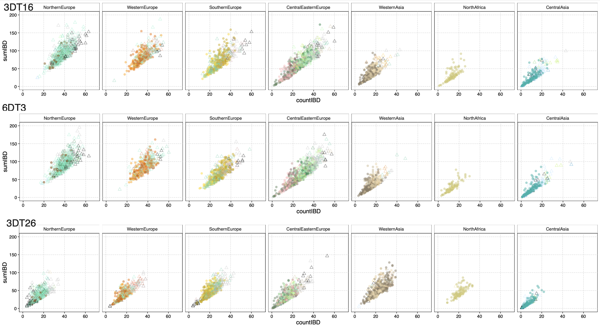

## Estimating IBD tracts using IBSseq with ancient genomes

### Interactive node

First, get an interactive node. 

```{bash, eval = FALSE}
# log in to the server (remember to change ku_username for your username)
ssh ku_username@mjolnirgate.unicph.domain

# request one CPU using salloc like this:
salloc --nodes=1 -D `pwd` --mem-per-cpu 15250 --ntasks-per-node=1 -t 1000  --reservation=3685-26-00-00 --account=teaching

# login to the node with srun like this:
srun --pty -n 1 -c 1 bash -i
```

Now that you are in a node of the server, we can create a directoy for the contamination exercises:
```{bash, eval = FALSE}
# remember to change ku_username for your username:
username="your_ku_username"
mkdir -p /projects/course_1/people/${username}/IbdSeq/

cd /projects/course_1/people/${username}/IbdSeq/
```

### Run IBDseq

We will run IBDseq <sup>1</sup> with a SNP panel for ancient individuals from Europe. In particular, we are interested in three individuals: 3DT26, 3DT16 and 6DT3 (from, <sup>2</sup>), from a Roman cemetery in York. 

We are interested in measuring how much IBD tracts share between them.

Start with a VCF that contains imputed data for ancient individuals from Europe: 
```{bash, eval = FALSE}
imputed.vcf.gz
imputed.vcf.gz.tbi
```

Load IBSseq and run it for chromosome 1 like this:
```{bash, eval = FALSE}
module load ibdseq/r1206 
ibdseq gt=imputed.vcf.gz out=imputed.1 chrom=1:1-248956422
```
Take a look at IBDseq's output: 
```{bash, eval = FALSE}
head imputed.1.ibd
```
```{bash, eval = FALSE}
sample1 hap1    sample2 hap2    chromosome      posStart        posEnd  lod     posCmStart      posCmEnd        lCm
0LS10_0LS10     0       3DT16_3DT16     0       22      33405865        33995412        3.14    37.7198865049017        38.7957806846977        1.07589417979602
0LS10_0LS10     0       6DT3_6DT3       0       22      27411419        30481322        3.45    31.0007574039724        34.1997964953193        3.19903909134684
0LS10_0LS10     0       12880A_12880A   0       22      20231084        22038535        4.32    11.7927460898297        16.0910385082464        4.29829241841671
```
Can you guess what the results represent? 

Filter the results to keep fragments that are at least 1Cm in length: 
```{R, eval = FALSE}
R

d<-read.table("imputed.1.ibd", as.is=T)
colnames(d)<-c("sample1", "hap1", "sample2", "hap2", "chromosome", "posStart", "posEnd", "lod")
recomb<-read.table("/projects/course_1/people/clx746/IbdSeq/genetic_map_b38_1.txt", header=TRUE)
d$posCmStart <- approx(recomb$position, recomb$Genetic_Map.cM., xout = d$posStart, rule = 2)$y
d$posCmEnd <- approx(recomb$position, recomb$Genetic_Map.cM., xout = d$posEnd, rule = 2)$y
d$lCm <- d$posCmEnd - d$posCmStart

# keep segments >= 1Cm
d<-d[d$lCm>=1,]
write.table(d, file="imputed.cM.1.ibd", row.names=F, col.names=T, quote=F, sep="\t")

q("no")
```

Summarise the results and estimate the length of the genome shared in IBD tracts between pairs of individuals (total length of IBD fragments):
```{bash, eval = FALSE}
tail -n +2 imputed.cM.1.ibd |awk '{print $1"\t"$3"\t"$5"\t"$11}'  |sort -k1,1 -k2,2 |/projects/mjolnir1/people/clx746/Scripts/datamash-1.3/datamash -g1,2  sum 4 >  ibd.summary
```

Count number of IBD segments shared between each pair of individuals:
```{bash, eval = FALSE}
tail -n +2 imputed.cM.1.ibd |awk '{print $1"\t"$3"\t"$5"\t"$11}'  |sort -k1,1 -k2,2 |/projects/mjolnir1/people/clx746/Scripts/datamash-1.3/datamash -g1,2  count 4 >  counts.ibd.summary
```

Check the total length of IBD fragments for the three individuals of interest: 
```{bash, eval = FALSE}
# 3DT26 vs 3DT16
grep 3DT26 ibd.summary | grep 3DT16
# 3DT26 vs 6DT3
grep 3DT26 ibd.summary |grep 6DT3
# 6DT3 vs 3DT16
grep 6DT3 ibd.summary 
```
Do the same for the IBD counts (counts.ibd.summary).

### Discuss: 

1. Do they all share the same number of IBD tracts?

2. Which pair of genomes shares the largest fraction of their genome in IBD tracts?

3. The following plot shows the number of IBD tracts (x-axis) vs the total length of genome shared in IBD tracts (y-axis) between each of our three individuals and many individuals from different population. Take a look at the plot and discuss what can you infer from it. 



### References

1. Browning BL, Browning SR. Detecting identity by descent and estimating genotype error rates in sequence data. Am J Hum Genet. 2013 Nov 7;93(5):840-51. doi: 10.1016/j.ajhg.2013.09.014. Epub 2013 Oct 24. PMID: 24207118; PMCID: PMC3824133.
2. Martiniano R, Caffell A, Holst M, Hunter-Mann K, Montgomery J, Müldner G, McLaughlin RL, Teasdale MD, van Rheenen W, Veldink JH, van den Berg LH, Hardiman O, Carroll M, Roskams S, Oxley J, Morgan C, Thomas MG, Barnes I, McDonnell C, Collins MJ, Bradley DG. Genomic signals of migration and continuity in Britain before the Anglo-Saxons. Nat Commun. 2016 Jan 19;7:10326. doi: 10.1038/ncomms10326. PMID: 26783717; PMCID: PMC4735653.


