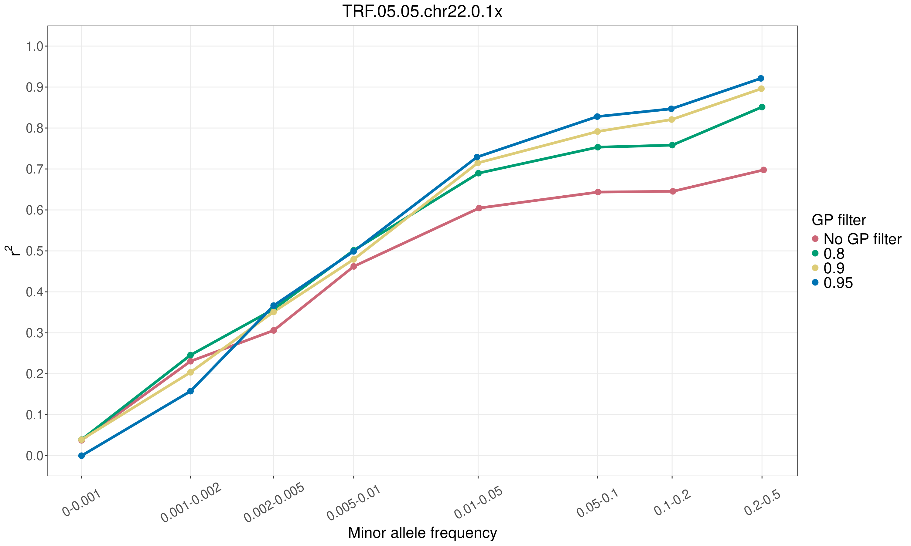
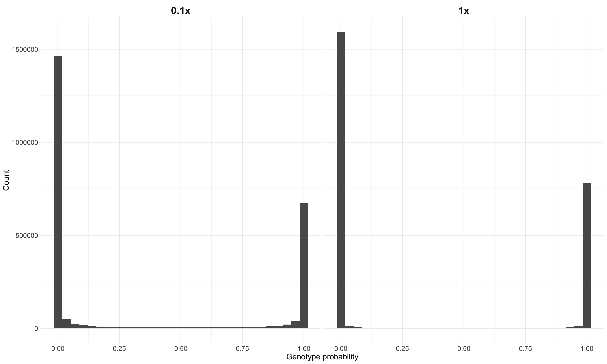
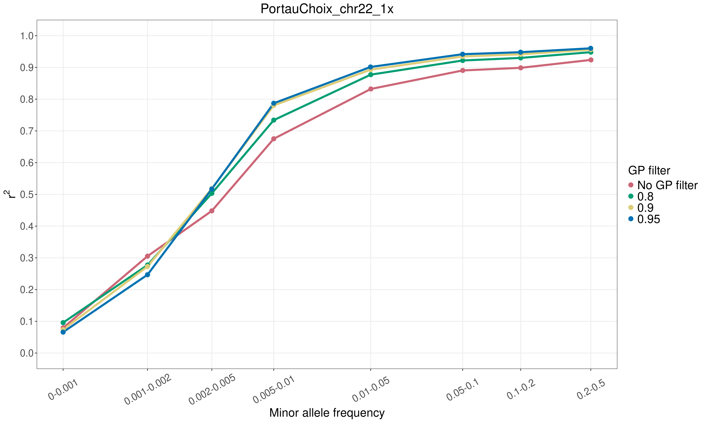
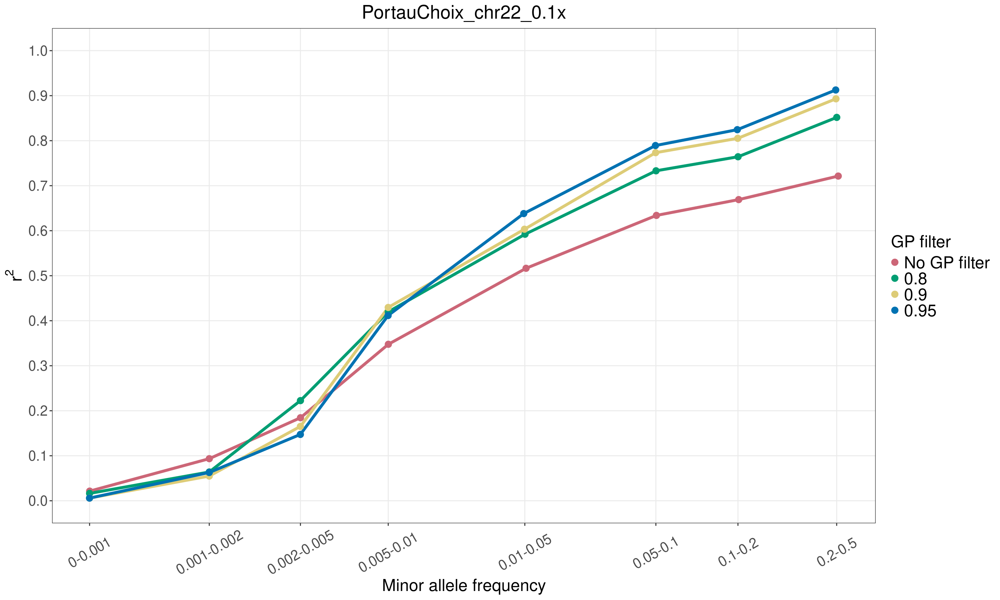

# aDNA_course_2026
Genotype imputation exercise for the 2026 aDNA course "Decoding the past: An introduction to ancient genomics"

### Introduction

This tutorial will show you how to run genotype imputation using GLIMPSE2 ([Rubinacci et al.,2021](https://doi.org/10.1038/s41588-020-00756-0), [Rubinacci et al.,2023](https://www.nature.com/articles/s41588-023-01438-3)), an imputation and phasing method tailored for low coverage sequencing data. We will test imputation accuracy in an ancient dog from Siberia, dated to 2,000 years before present (ybp). This sample is relatively high coverage for ancient standards (11.8x), so in order to test the imputation accuracy, we will downsample it to lower coverages (0.1x and 1x) and see how the imputed genotypes compare to the "true" high coverage ones.

We will run GLIMPSE from sequencing reads data (BAM files) to obtain imputed and phased genotypes.

For this tutorial, we will focus only on chromosome 22.

### Activate interactive session
```
# request one CPU using salloc like this:
salloc --nodes=1 -D `pwd` --mem-per-cpu 10250 --ntasks-per-node=1 -t 1000  --reservation=3685-26-00-00 --account=teaching

# once the job has been allocated, you can login to the node with srun like this:
srun --pty -n 1 -c 1 bash -i
```

### Create directory
```
directoryImputation="/home/${USER}/Imputation/"
mkdir -p $directoryImputation
# go into the directory
cd $directoryImputation
```


### Set paths to data folder
```
COURSE_PATH=/projects/course_1
DATA_PATH=${COURSE_PATH}/people/qcj125/data_exercise
```

### Load required modules ####
```
module load bcftools/1.15.1
module load glimpse-bio/2.0.1
module load gcc/13.2.0
module load openjdk/20.0.0
module load R/4.5.1
```


## Exercise 1: Explore input data
We will use the following files:  
1) Reference panel  
2) Genetic (recombination) map  
3) Reference fasta file  
4) Ancient dog bam files  

### Reference panel
```
REF=${DATA_PATH}/reference_panel_vcf/ref-panel_chr22.vcf.gz
```

Let's take a look:  
```
bcftools view ${REF} | less -S
```

#### Questions: 
1) How many sites are in the panel for chr22?  
2) Are the sites phased?
3) How many samples are in the reference panel?  
4) What species are present?

#### Hints (use these commands to answer the above questions): 
```
bcftools view -H ${REF} | wc -l
bcftools view ${REF} | less -S
bcftools query -l ${REF} | wc -l
bcftools query -l ${REF} | less -S
```

### Bam files
These include the initial high coverage bam file and the downsampled ones to 1x and 0.1x coverage:
```
ls ${DATA_PATH}/bams_down/TRF.05.05.chr22.bam
ls ${DATA_PATH}/bams_down/TRF.05.05.chr22.0.1x.bam
ls ${DATA_PATH}/bams_down/TRF.05.05.chr22.1x.bam
```

### Genetic map (recombination map)
```
MAP=${DATA_PATH}/gen_map/chr22_average_canFam3.1_modified.txt
```

Let's take a look:  
```
less ${MAP}
```

The three columns are genomic position, chromosome, and distance in cM.

#### Question: 
Why do you think we need a genetic map for imputation?

### Reference genome (fasta files)
```
REFGEN=${DATA_PATH}/reference_fasta/CanFam31_chr22.fasta
```

**Note!!!** It is important to make sure the reference panel samples and target samples have been mapped with the same reference genome, and that you use the correct one for imputation.


## Exercise 2: Imputing an ancient dog genome with GLIMPSE
We will now run different steps as part of the GLIMPSE imputation pipeline and impute the 1x ancient Siberian dog sample.

Make output directories (ONLY RUN THIS ONCE!)
```
mkdir -p output/reference_panel
mkdir -p output/GLs_target_bams
mkdir -p output/chunks
mkdir -p output/GLIMPSE_imputed
mkdir -p output/GLIMPSE_ligated
mkdir -p output/GLIMPSE_concordance
```

### Step 1: Extract variable positions from the reference panel  
The first step is to extract the list of variable sites from the reference panel in a tsv format, to be used downstream for computing genotype likelihoods in the ancient samples (see below)

The -G option drops individual genotype information (not needed at this step)
The -m 2 -M 2 -v snps retains biallelic snps

```
REF=${DATA_PATH}/reference_panel_vcf/ref-panel_chr22.vcf.gz
VCF=output/reference_panel/chr22_ref_panel_sites.vcf.gz

bcftools view \
-G -m 2 -M 2 -v snps \
${REF} \
-Oz -o ${VCF}

bcftools index -f ${VCF}
```

Get the chrom, pos, ref and alt fields for each site and put it into a new tsv file:
```
VCF=output/reference_panel/chr22_ref_panel_sites.vcf.gz
TSV=output/reference_panel/chr22_ref_panel_sites.tsv.gz

bcftools query -f'%CHROM\t%POS\t%REF,%ALT\n' \
${VCF} | \
bgzip -c > ${TSV}

tabix -s1 -b2 -e2 ${TSV}
```

Take a look at the vcf and tsv files from above:    
```
bcftools view output/reference_panel/chr22_ref_panel_sites.vcf.gz | less -S
```
```
less -S output/reference_panel/chr22_ref_panel_sites.tsv.gz
```


### Step 2: Compute genotype likelihoods at each position

#### Let's start with the 1x ancient Siberian dog
```
SAMPLE=TRF.05.05.chr22.1x
```

The bcftools mpileup command generates a VCF containing genotype likelihoods for a bam file at specified sites. Then bcftools call uses the genotype likelihoods to infer genotypes.

```
BAM=${DATA_PATH}/bams_down/${SAMPLE}.bam
VCF=output/reference_panel/chr22_ref_panel_sites.vcf.gz
TSV=output/reference_panel/chr22_ref_panel_sites.tsv.gz
REFGEN=${DATA_PATH}/reference_fasta/CanFam31_chr22.fasta
GL=output/GLs_target_bams/${SAMPLE}.vcf.gz

bcftools mpileup \
-f ${REFGEN} \
-I -E -a 'FORMAT/DP' \
-T ${VCF} \
-r chr22 ${BAM} -Ou | \
bcftools call \
-Aim \
-C alleles \
-T ${TSV} \
-Oz -o ${GL} \
--threads 6

bcftools index -f ${GL}


# bcftools mpileup options:
# -f ${REFGEN} Reference genome in a fasta file
# -I Ignore indels
# -E Recalculate BAQ on the fly, ignore existing BQ tags
# -a 'FORMAT/DP' Annotate per-sample read depth in the FORMAT field (DP).
# -T ${VCF} Sites file
#
# bcftools call options:
# -Aim A: Keep all alternative sites, i: output also sites missed by mpileup but present in -T, m: alternative model for multiallelic and rare-variant calling 
# -C alleles Call genotypes given the alleles in the TSV file below
# -T TSV file with the allowed alleles list 
```


### Step 3a: Splitting each chromosome into chunks to define where to perform imputation. 

```
VCF=output/reference_panel/chr22_ref_panel_sites.vcf.gz
CHUNK=output/chunks/chr22_chunks.txt
MAP=${DATA_PATH}/gen_map/chr22_average_canFam3.1_modified.txt

GLIMPSE2_chunk \
--input ${VCF} \
--region chr22 \
--sequential \
--output ${CHUNK} \
--map ${MAP}

# --sequential Activates the recommended sequential algorithm
```


### Step 3b: Splitting the reference panel into the GLIMPSE2 file format using the chunks from above. This creates a binary reference panel for quick reading time.

```
VCF_CHUNK=output/chunks/ref_panel_chunks
REF=${DATA_PATH}/reference_panel_vcf/ref-panel_chr22.vcf.gz


while IFS="" read -r LINE || [ -n "$LINE" ]; do
    printf -v ID "%02d" $(echo $LINE | cut -d" " -f1)
    IRG=$(echo $LINE | cut -d" " -f3)
    ORG=$(echo $LINE | cut -d" " -f4)

    GLIMPSE2_split_reference \
        --reference ${REF} \
        --map ${MAP} \
        --input-region ${IRG} \
        --output-region ${ORG} \
        --output ${VCF_CHUNK}
done < ${CHUNK}
```

### Step 4: Impute! For each of the chunks estimated at Step 3a, impute using the binary reference panel from Step 3b and the genotype likelihoods from Step 2

```
GL=output/GLs_target_bams/${SAMPLE}.vcf.gz
CHUNK=output/chunks/chr22_chunks.txt
VCF_CHUNK=output/chunks/ref_panel_chunks
OUT=output/GLIMPSE_imputed/${SAMPLE}


while IFS="" read -r LINE || [ -n "$LINE" ]; 
do   
	printf -v ID "%02d" $(echo $LINE | cut -d" " -f1)
	IRG=$(echo $LINE | cut -d" " -f3)
	ORG=$(echo $LINE | cut -d" " -f4)
	CHR=$(echo ${LINE} | cut -d" " -f2)
	REGS=$(echo ${IRG} | cut -d":" -f 2 | cut -d"-" -f1)
	REGE=$(echo ${IRG} | cut -d":" -f 2 | cut -d"-" -f2)

	GLIMPSE2_phase --input-gl ${GL} --reference ${VCF_CHUNK}_chr22_${REGS}_${REGE}.bin --output ${OUT}_chr22_${REGS}_${REGE}.bcf
	
done < ${CHUNK}
```

Take a small break while this is running :)


### Step 5: Ligate the chunks together
After imputing, we can now merge all of the imputed chunks together, using the GLIMPSE2_ligate tool:

```
#make a list with file names to merge:
LIST=output/GLIMPSE_ligated/list.chr22.txt
ls -1v output/GLIMPSE_imputed/${SAMPLE}*.bcf > ${LIST}

LIGATED=output/GLIMPSE_ligated/${SAMPLE}.ligated.bcf

GLIMPSE2_ligate \
--input ${LIST} \
--output ${LIGATED}

bcftools index -f ${LIGATED}
```


#### Congrats, you have now imputed and phased an ancient dog sample!

Let's take a look at the final phased and imputed file:
```
bcftools view ${LIGATED} | less -S
```

Take a moment to understand the different fields. What does the FORMAT/GP field and the three numbers represent?

Question:  
How many imputed sites are there? How does it compare the number of sites in the reference panel?

#### Hint (use this command to answer the above questions): 
```
bcftools view -H ${LIGATED} | wc -l
```


## Exercise 3: Checking imputation accuracy

### Let's take a look at how accurate the imputation is!

Since our ancient dog sample is "high coverage", we can use the genotypes from it as the "true genotypes", and compare them to the imputed genotypes. This will give us an idea of how accurate the imputation went.

You can find the "true genotypes" here:


Luckily, GLIMPSE has an additional tool called GLIMPSE2_concordance, which can do this for us.


What we need for GLIMPSE_concordance is a file with the sample name and a file containing the following information:
1) The chromosome (or region) we're interested in
2) A file with the allele frequencies at each site (this is in the reference panel)
3) The "true genotypes" from the high coverage ancient sample
4) The imputed data

Make file with required inputs:
```
REF=${DATA_PATH}/reference_panel_vcf/ref-panel_chr22.vcf.gz
TRUE=${DATA_PATH}/validation_bams/TRF.05.05_chr22_validation_filt_qual_dp_ab.bcf

echo "chr22" ${REF} ${TRUE} ${LIGATED} > output/GLIMPSE_concordance/lst_${SAMPLE}.txt
```

Run GLIMPSE2_concordance for our imputed sample. This will take a few minutes.
```
LST=output/GLIMPSE_concordance/lst_${SAMPLE}.txt

GLIMPSE2_concordance \
--input ${LST} \
--min-val-dp 8 \
--min-val-gl 0.9 \
--output output/GLIMPSE_concordance/${SAMPLE} \
--bins 0.00000 0.00100 0.00200 0.00500 0.01000 0.05000 0.10000 0.20000 0.50000

# --min-val-dp: Minimum coverage in validation data
# --min-val-gl: Minimum genotype likelihood probability P(G|R) in validation data
```

Now there are different output files produced at this step, but let's focus on the one finishing in "rsquare.grp.txt.gz": 
```
less -S output/GLIMPSE_concordance/${SAMPLE}.rsquare.grp.txt.gz
```

This file has 5 columns, but we're interested in the 1st (MAF bin number) and fourth (aggregative r^2). We'll use these two columns to plot the imputation accuracy in a bit.

```
Now, let's come back to the FORMAT/GP field we saw above. This field essentially indicates how confident the site was imputed. 
The GP fields correspond to the genotype posteriors of the three possible genotypes (for a diploid sample), ranging from 0 to 1: REF/REF, REF/ALT and ALT/ALT. All three fields sum up to 1. 
The closer to 1, the more certain we are about that imputed site. 
As we saw in the previous exercise, all the sites present in the reference panel will also be imputed in the ancient sample. 
However, this does not mean that every imputed site will be correct. 
Therefore, it's a good approach to filter out low-confidence imputed site based on the GP field. 

Let's check the concordance of the imputed sites after applying three different GP cutoffs: 0.8, 0.9, 0.95. The higher the cutoff, the more strict we are, and the more sites are filtered out.

### Adding GP post-imputation filter, using the --min-tar-gp option:
for i in 0.8 0.9 0.95
do
GLIMPSE2_concordance \
--input ${LST} \
--min-val-dp 8 \
--min-val-gl 0.9 \
--min-tar-gp ${i} \
--output output/GLIMPSE_concordance/${SAMPLE} \
--bins 0.00000 0.00100 0.00200 0.00500 0.01000 0.05000 0.10000 0.20000 0.50000
done
```

#### Plot imputation accuracy at 1x coverage across different GP filters

```
Rscript ${DATA_PATH}/scripts/glimpse_accuracy.R ${SAMPLE}
```

In order to download the figure from the server to your local machine, run this command (remember to change it to your own username!!!)
```
scp qcj125@mjolnirgate.unicph.domain:/home/qcj125/Imputation/imputation_accuracy_TRF.05.05.chr22.1x.png .
```

Questions: 
1) What do you notice about the different MAF bins? Would you apply a MAF cutoff? Why?
2) What do you notice from this plot about the different GP filters?
3) What combination of post-imputation filters would you apply?


## Exercise 4: Checking imputation accuracy at 0.1x

If you have time, re-run the imputation steps 2,4 and 5, this time using the 0.1x downsampled dog (Change the SAMPLE name from TRF.05.05.chr22.1x to TRF.05.05.chr22.0.1x in Step 2, and then re-run the following steps as is). 

Then plot the results:
```
Rscript ${DATA_PATH}/scripts/glimpse_accuracy.R ${SAMPLE}
```

If you don't have time to run the 0.1x sample, you can find the plot showing the imputation accuracy here: 



Questions:  
What differences do you notice between the 1x and 0.1x imputed samples? Why? 

Let's look at the distribution of GP scores for 1x and 0.1x:



Question:
What difference do you notice in the GPs between the two coverages? How does this relate to the accuracy results?

Another thing to keep in mind, is how many sites you're retaining after post-imputation filtering.


Let's see how many are left after filtering for different GP filters for the two tested coverages:
```
# For 1x coverage:
for i in 0 0.8 0.9 0.95
do
echo "Number of sites with $i GP filter:"
bcftools view -H \
output/GLIMPSE_ligated/TRF.05.05.chr22.1x.ligated.bcf \
--include "FORMAT/GP >= ${i}" | wc -l
done

# For 0.1x coverage
for i in 0 0.8 0.9 0.95
do
echo "Number of sites with $i GP filter:"
bcftools view -H \
output/GLIMPSE_ligated/TRF.05.05.chr22.0.1x.ligated.bcf \
--include "FORMAT/GP >= ${i}" | wc -l
done
```

Question:
1) How does the number of retained sites vary between different coverages and GP filters?
2) Would you impute a really low coverage sample (say 0.01x) and apply a GP filter?


## Exercise 5: Impact of ancestral representation in the reference panel

Since imputation relies on the haplotypes present in the reference panel, we would expect that the representation of ancestries among the samples in the panel will impact the imputation accuracy. Ideally, we will have the ancestry of our target sample also present among the reference panel haplotypes. 

Let's impute a different ancient dog sample, from North America dated to ~4,000 ybp. This is a pre-contact American dog, a lineage that existed in the Americas which rapidly disappeared following the arrival of European settlers, leaving minimal trace in present-day dogs.   

All the imputation steps have already been run, and we're ready to plot the accuracy:

Plot for 1x coverage:


Plot for 0.1x coverage:



Question: 
1) How does the accuracy of the ancient North American dog compare to that of the ancient Siberian dog? Why do you think that is?
2) Would you impute low coverage ancient North American pre-contact dogs? 
