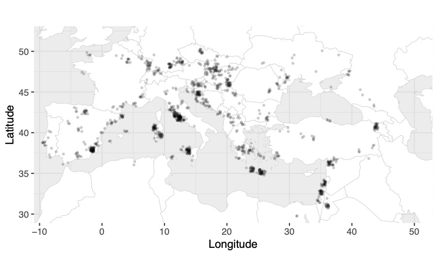

## Using Locator to find the most likely geographic origin of an ancient sample

### Interactive node

First, get an interactive node. 

```{bash, eval = FALSE}
# log in to the server (remember to change ku_username for your username)
ssh ku_username@mjolnirgate.unicph.domain

# request one CPU using salloc like this:
salloc --partition=cpuqueue --nodes=1 -D `pwd` --mem-per-cpu 5250 --ntasks-per-node=1 -t 1000 --qos=teaching --reservation=aDNA_PHD_course --account=teaching

# login to the node with srun like this:
srun --pty -n 1 -c 1 bash -i
```

Now that you are in a node of the server, we can create a directoy for the contamination exercises:
```{bash, eval = FALSE}
# remember to change ku_username for your username:
username="your_ku_username"
mkdir -p /projects/course_1/people/${username}/Locator/

cd /projects/course_1/people/${username}/Locator/
```

### Install location (backup)

In case you cannot run locator or load the module: 

```{bash, eval = FALSE}
cd /projects/course_1/people/${username}/
git clone https://github.com/kr-colab/locator.git
cd locator
pip3 install .
```

### Option 1: Human dataset

We will estimate the geographic location of Log02, ancient individual that lived in the Bronze Age <sup>1</sup>, using locator <sup>2</sup> assumming we don't know its geographic origin. 

You need two files: 
```{bash, eval = FALSE}
ls /projects/course_1/people/clx746/DataLoc/*
```
```
/projects/course_1/people/clx746/DataLoc/Merged_24012023_Rohland_noanc_05miss.vcf.gz
/projects/course_1/people/clx746/DataLoc/Merged_24012023_Rohland_noanc_coords.txt
```

The first one is a VCF with SNP data of individuals of interest: 

```{bash, eval = FALSE}
zcat /projects/course_1/people/clx746/DataLoc/Merged_24012023_Rohland_noanc_05miss.vcf.gz |grep -v "##" |head -n 5 
```
```
#CHROM  POS     ID      REF     ALT     QUAL    FILTER  INFO    FORMAT  Albania_BA_IA_I14688    Albania_BA_IA_I14690    Albania_BA_IA_I14692    Albania_BA_IA_I16251    Albania_BA_IA_I16254    Albania_BA_IA_1d.rel.I17633_I16256     Albania_IA_I16253       Albania_MBA_I8471       Algeria_NumidoRoman_Berber.SG_R10760.SG Algeria_NumidoRoman_Berber.SG_R10766.SG .....
1       846864  1:846864        G       C       .       .       .       GT      1/1     ./.     0/0     ./.     ./.     0/0     ./.     ./.     ./.     ./.     0/0     0/0     ./.     0/0     0/0     ./.   0/0      1/1     0/0     ./.     ./.     0/0     0/0     0/0     0/0     1/1     ./.     ./.     0/0     ./.     0/0     ./.     0/0     ./.     1/1     0/0     0/0     0/0     0/0     0/0     0/0     0/0   ./.      ./.     1/1     0/0     0/0     ./.     0/0     0/0     0/0     0/0     0/0     0/0     ./.     ./.     0/0     ./.     ./.     ./.     ./.     ./.     0/0     0/0     ./.     0/0     0/0     0/0   0/0      1/1     0/0     0/0     0/0     0/0     0/0     0/0     1/1     0/0    ....
```


In this case we are using a dataset that consists of ancient human individuals with focus on Europe and from the Bronze to the Iron age: 



You also need a table with the geographic coordinates of all the invididuals in you VCF (notice that the individual for which we are interested in inferring the origin is marked as NA): 

```{bash, eval = FALSE}
head /projects/course_1/people/clx746/DataLoc/Merged_24012023_Rohland_noanc_coords.txt
```
```
"x"     "y"     "sampleID"
20.388611       42.020556       "Albania_BA_IA_I14688"
20.388611       42.020556       "Albania_BA_IA_I14690"
20.388611       42.020556       "Albania_BA_IA_I14692"
20.388611       42.020556       "Albania_BA_IA_I16251"
20.388611       42.020556       "Albania_BA_IA_I16254"
20.388611       42.020556       "Albania_BA_IA_1d.rel.I17633_I16256"
20.388611       42.020556       "Albania_IA_I16253"
19.29   42.15   "Albania_MBA_I8471"
5.4108  36.1898 "Algeria_NumidoRoman_Berber.SG_R10760.SG"
...
NA      NA      "Greece_MBA_Log02.SG"
```

Once you have these two files, you can run locator like this: 
```{bash, eval = FALSE}
mkdir OutputLocator
locator --vcf /projects/course_1/people/clx746/DataLoc/Merged_24012023_Rohland_noanc_05miss.vcf.gz --sample_data /projects/course_1/people/clx746/DataLoc/Merged_24012023_Rohland_noanc_coords.txt --out OutputLocator/
```

Once it is done running you'll get a predicted location for your ancient individual: 
```{bash, eval = FALSE}
cat
```
```
```

If it is taking too long to run, you can look at the results here: 
```
ls /projects/course_1/people/clx746/Locator/OutputLocator/*
```

Plot the results using ggplot2: 
```{bash, eval = FALSE}
R

library(ggplot2)

global <- map_data("world") 

anc<-read.table("selection_coords.txt", as.is=T, h=T, sep="\t", comment.char="")

basena<-"wolves"

predLocs<-read.table(paste0(basena, "/", basena, "_predlocs.txt"), as.is=T, h=T, sep=",")

pdf("Locator_map", width=10, height=5.5)
ggplot()+
geom_polygon(data=global, aes(x=long, y=lat, group=group), color="gainsboro", fill="ghostwhite", linewidth=0.1)+
geom_point(data=anc, aes(x=x, y=y), colour="black", shape=16, size=1, alpha=0.5, show.legend=F)+
geom_point(data=predLocs, aes(x=x, y=y), colour="firebrick1", pch=17)+
theme(panel.background = element_rect(fill='gainsboro', colour='black'), axis.text.x = element_text(angle = 45, hjust = 1, colour='black'), axis.text.y = element_text(colour='black'), strip.background = element_rect(linewidth=.2, colour="black", fill ="#FFA5004D"), panel.grid.major = element_blank(), panel.grid.minor = element_blank(), legend.title=element_text(size=5), legend.key=element_rect(fill="white", colour="white"), legend.position = "right", axis.title=element_text(size=14), legend.text=element_text(size=5))
dev.off()

q("no")
```

### Option 2: your ancient canid

If you decide to try to place your ancient canid in a map, we need to start by selecting a subset of the samples that we are interested in including in the analysis. Depending on which sample you chose, it might be that you want to use only dogs, or only wolves... so decide which one you need and copy and paste the lines below acordingly.

Prepare your SNP panel:
```{bash, eval = FALSE}
username="your_username"
# If you want to include only dogs run this:
grep -e Dog  -e Ancient /projects/course_1/people/${username}/ExploratoryAnalyses/wolves_mergedTv.fam | cut -f 1,2 -d " " > keep.txt

# If you want to include only wolves run this:
grep -e Wolf  -e Ancient /projects/course_1/people/${username}/ExploratoryAnalyses/wolves_mergedTv.fam | cut -f 1,2 -d " " > keep.txt

# The extract the subset of individuals using plink:
module load plink/1.9.0
# remember to change your username:
username="your_username"
plink --bfile /projects/course_1/people/${username}/ExploratoryAnalyses/wolves_mergedTv --keep keep.txt  --allow-extra-chr  --make-bed --out wolves_mergedTv_keep

# now we will convert our PLINK files into a VCF:
plink --bfile wolves_mergedTv_keep --recode vcf --allow-extra-chr  --out wolves_mergedTv_keep

# and gzip the VCF:
gzip wolves_mergedTv_keep.vcf 
```

Now we need to create a table with the geographic coordinates of the 'know' samples: 
```{bash, eval = FALSE}
zcat wolves_mergedTv_keep.vcf.gz |grep "^#CHROM"  |cut -f 10- |perl -pe 's/\t/\n/g;' > IDs_vcf_selection.txt

R

anc<-read.table("/projects/course_1/people/clx746/Data/wolves_coords.txt", as.is=T, h=T, sep="\t", comment.char="")
idsS<-readLines("IDs_vcf_selection.txt")

x<-NULL
y<-NULL
for(i in 1:length(idsS)){
	x<-c(x, anc$x[paste0(anc$sampleID, "_", anc$sampleID)==idsS[i]])
	y<-c(y, anc$y[paste0(anc$sampleID, "_", anc$sampleID)==idsS[i]])
}

d<-data.frame(x=x, y=y, sampleID=idsS)
write.table(d, col.names=T, row.names=F, sep="\t", file="selection_coords.txt")

q("no")
```

Our table will look like this (notice how our ancient sample is marked with NA):
```{bash, eval = FALSE}
head selection_coords.txt
```
```
"x"     "y"     "sampleID"
NA      NA      "AncientCanid_AncientCanid"
-158    67      "Wolf_Alaska_Wolf_Alaska"
-91.570107      43.081267       "Wolf_AtlanticCoast_Wolf_AtlanticCoast"
134.4795        68.918111       "Wolf_BungeToll_Wolf_BungeToll"
88.68217        31.3291724      "Wolf_Chinese_Wolf_Chinese"
88.68217        31.3291724      "Wolf_Chinese2_Wolf_Chinese2"
15.2619831      45.1187943      "Wolf_Croatian_Wolf_Croatian"
-85.42  77.22   "Wolf_Ellesmere_Wolf_Ellesmere"
82.4104216      50.7793339      "Wolf_GW_Wolf_GW"

```

And now we can run locator like this:
```{bash, eval = FALSE}
mkdir wolves
locator --vcf wolves_mergedTv_keep.vcf.gz --sample_data selection_coords.txt --out wolves/wolves
```

Once it is done running you'll get a predicted location for your ancient individual: 
```{bash, eval = FALSE}
cat  wolves/wolves_predlocs.txt 
```
```
x,y,sampleID
23.81999373520123,55.724578965398926,AncientCanid_AncientCanid
```

Plot the results using ggplot2: 
```{bash, eval = FALSE}
R

library(ggplot2)

global <- map_data("world") 

anc<-read.table("selection_coords.txt", as.is=T, h=T, sep="\t", comment.char="")

basena<-"wolves"

predLocs<-read.table(paste0(basena, "/", basena, "_predlocs.txt"), as.is=T, h=T, sep=",")

pdf("Locator_map.pdf", width=10, height=5.5)
ggplot()+
geom_polygon(data=global, aes(x=long, y=lat, group=group), color="gainsboro", fill="ghostwhite", linewidth=0.1)+
geom_point(data=anc, aes(x=x, y=y), colour="black", shape=16, size=1, alpha=0.5, show.legend=F)+
geom_point(data=predLocs, aes(x=x, y=y), colour="firebrick1", pch=17)+
theme(panel.background = element_rect(fill='gainsboro', colour='black'), axis.text.x = element_text(angle = 45, hjust = 1, colour='black'), axis.text.y = element_text(colour='black'), strip.background = element_rect(linewidth=.2, colour="black", fill ="#FFA5004D"), panel.grid.major = element_blank(), panel.grid.minor = element_blank(), legend.title=element_text(size=5), legend.key=element_rect(fill="white", colour="white"), legend.position = "right", axis.title=element_text(size=14), legend.text=element_text(size=5))
dev.off()

q("no")
```

### References

1. Clemente F, *et al* (2021). The genomic history of the Aegean palatial civilizations. Cell.

2. Battey CL, *et al* (2020). Predicting geographic location from genetic variation with deep neural networks. eLife.

