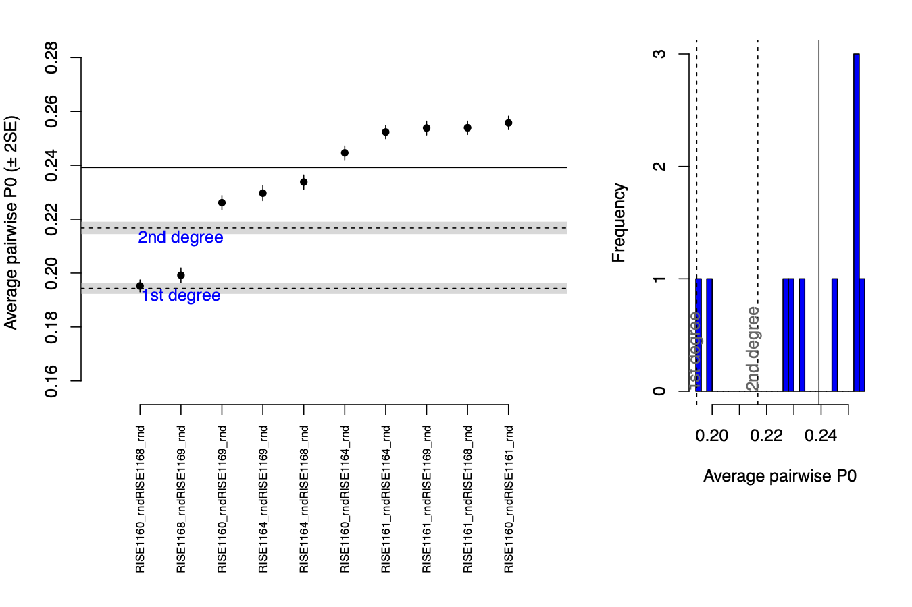

## Estimating relatedness with ancient sequencing data

### Outline:

* Estimating relatedness using READ
* Estimating relatedness using KIN


### Interactive node

Get an interactive node: 

```{bash, eval = FALSE}
# First log in to the server (remember to change ku_username for your username)
ssh ku_username@mjolnirgate.unicph.domain

# first request one CPU using salloc like this:
salloc --partition=cpuqueue --nodes=1 -D `pwd` --mem-per-cpu 5250 --ntasks-per-node=1 -t 1000 --qos=teaching --reservation=aDNA_PHD_course --account=teaching

# once the job has been allocated, you can login to the node with srun like this:
srun --pty -n 1 -c 1 bash -i
```

Now, let's create a directory for these exercises:
```{bash, eval = FALSE}
# remember you change for you username
username="write_your_username"
directory="/projects/course_1/people/${username}/relatedness/"
mkdir -p $directory

# go to the directory
cd $directory
```

### Estimating relatedness in the Koszyce invididuals

#### READ

`READ` <sup>1</sup> is a method that was developed specifically for low coverage data, so it requires pseudo-haploid calls like the ones we have been using in previous days. 

**Dataset**

For this session we will be working on the data from Schroeder et al. 2019 PNAS <sup>2</sup>.

We'll be working with these PLINK files:
```
/projects/course_1/people/clx746/DataRelatedness/2_plink/koszyce_1240k_subset.bed
/projects/course_1/people/clx746/DataRelatedness/2_plink/koszyce_1240k_subset.fam
/projects/course_1/people/clx746/DataRelatedness/2_plink/koszyce_1240k_subset.bim
```
These contain SNP data for 5 related individuals.  

```{bash, eval=FALSE}
cat /projects/course_1/people/clx746/DataRelatedness/2_plink/koszyce_1240k_subset.fam
```
```
RISE1160_rnd RISE1160_rnd 0 0 0 -9
RISE1161_rnd RISE1161_rnd 0 0 0 -9
RISE1164_rnd RISE1164_rnd 0 0 0 -9
RISE1168_rnd RISE1168_rnd 0 0 0 -9
RISE1169_rnd RISE1169_rnd 0 0 0 -9
```
Now let's see how we can run ```READ```. 

```READ``` will automatically assign a default name for the output, so we have to change the output name once it is done running.  

You can run it like this (we won't run it this time since our AWS servers don't have enouth RAM for it to work, so just take a look at how it is run and download the output after): 
```
# load python
module unload python
module load python/2.7.17

# run read:
python /projects/course_1/people/clx746/Data/read/READ.py /projects/course_1/people/clx746/DataRelatedness/2_plink/koszyce_1240k_subset
```

Download the results, for example:
```{bash, eval = FALSE}
scp clx746@mjolnirgate.unicph.domain:/projects/course_1/people/clx746/Relatedness/READ_results_plot.pdf .
```

It will look like this:


#### KIN

Now we will run KIN on the same individuals. KIN needs sequencing reads, so we will use the following BAM files as input:

```{bash, eval=FALSE}
module load kin/3.1.4

# create a list of SNPs that we will be used based on the previous PLINK files:
cut -f 1,4,5,6 /projects/course_1/people/clx746/DataRelatedness/2_plink/koszyce_1240k_subset.bim  | awk -v OFS="\t" '{print $1, $2 - 1, $2, $3, $4}' > koszyce_1240k_snps.bed

echo 'RISE1160.0.1
RISE1161.0.1
RISE1164.0.1
RISE1168.0.1
RISE1169.0.1' > Inds.txt

# first run KINgaroo
KINgaroo -bam /projects/course_1/people/clx746/DataRelatedness/1_bams -bed koszyce_1240k_snps.bed -T Inds.txt -cnt 0 > king.log

# then run KIN
KIN -I /projects/course_1/people/clx746/Relatedness/ -O /projects/course_1/people/clx746/Relatedness/analysis/ > kin.log

```

Check the results and compare them with the ones you got from READ: 
```
cat analysis/KIN_results.csv 
```
```
 Pair   Relatedness     Second Guess    Log Likelihood Ratio    Within Degree Second Guess      Within Degree Log Likelihood Ratio      k0      k1      k2      IBD Length      IBD Number
0       RISE1160.0.1_._RISE1161.0.1     Unrelated       Third Degree    16.153                  1.0     0.0     0.0     0       1
1       RISE1160.0.1_._RISE1164.0.1     Unrelated       Third Degree    9.042                   1.0     0.0     0.0     0       1
2       RISE1160.0.1_._RISE1168.0.1     Parent-Child    Second Degree   9.436   Siblings        28.52173803749793       0.0     1.0     0.0     290     1
3       RISE1160.0.1_._RISE1169.0.1     Third Degree    Second Degree   1.1                     0.711   0.289   0.0     50      6
4       RISE1161.0.1_._RISE1164.0.1     Unrelated       Third Degree    14.272                  1.0     0.0     0.0     0       1
5       RISE1161.0.1_._RISE1168.0.1     Unrelated       Third Degree    18.431                  1.0     0.0     0.0     0       1
6       RISE1161.0.1_._RISE1169.0.1     Unrelated       Third Degree    15.225                  1.0     0.0     0.0     0       1
7       RISE1164.0.1_._RISE1168.0.1     Unrelated       Third Degree    3.275                   0.919   0.081   0.0     3       1
8       RISE1164.0.1_._RISE1169.0.1     Unrelated       Third Degree    0.009                   0.842   0.158   0.0     25      2
9       RISE1168.0.1_._RISE1169.0.1     Second Degree   Siblings        8.645                   0.376   0.624   0.0     186     12
```


