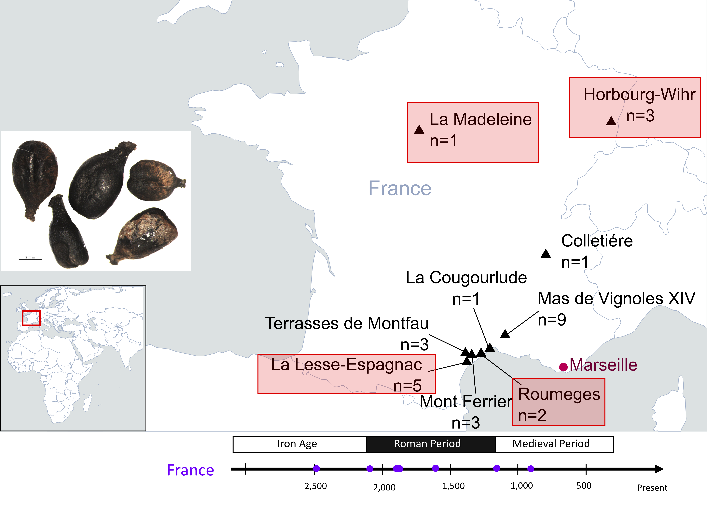

## Estimating relatedness with ancient sequencing data

### Outline:

* Estimating relatedness in the Koszyce invididuals
* Estimating relatedness is in ancient wolves
* Estimating relatedness in ancient grapes


### Interactive node

Get an interactive node: 

```{bash, eval = FALSE}
# First log in to the server (remember to change ku_username for your username)
ssh ku_username@mjolnirgate.unicph.domain

# first request one CPU using salloc like this:
salloc --partition=cpuqueue --nodes=1 -D `pwd` --mem-per-cpu 5250 --ntasks-per-node=1 -t 1000 --qos=teaching --reservation=aDNA_PHD_course --account=teaching

# once the job has been allocated, you can login to the node with srun like this:
srun --pty -n 1 -c 1 bash -i
```

Now, let's create a directory for these exercises:
```{bash, eval = FALSE}
# remember you change for you username
username="write_your_username"
directory="/projects/course_1/people/${username}/relatedness/"
mkdir -p $directory

# go to the directory
cd $directory
```

### Estimating relatedness in the Koszyce invididuals

#### READ

`READ` <sup>1</sup> is a method that was developed specifically for low coverage data, so it requires pseudo-haploid calls like the ones we have been using in previous days. 

**Dataset**

For this session we will be working on the data from Schroeder et al. 2019 PNAS <sup>2</sup>.

We'll be working with these PLINK files:
```
/projects/course_1/people/clx746/DataRelatedness/2_plink/koszyce_1240k_subset.bed
/projects/course_1/people/clx746/DataRelatedness/2_plink/koszyce_1240k_subset.fam
/projects/course_1/people/clx746/DataRelatedness/2_plink/koszyce_1240k_subset.bim
```
These contain SNP data for 5 related individuals.  

```{bash, eval=FALSE}
cat /projects/course_1/people/clx746/DataRelatedness/2_plink/koszyce_1240k_subset.fam
```
```
RISE1160_rnd RISE1160_rnd 0 0 0 -9
RISE1161_rnd RISE1161_rnd 0 0 0 -9
RISE1164_rnd RISE1164_rnd 0 0 0 -9
RISE1168_rnd RISE1168_rnd 0 0 0 -9
RISE1169_rnd RISE1169_rnd 0 0 0 -9
```
Now let's see how we can run ```READ```. 

```READ``` will automatically assign a default name for the output, so we have to change the output name once it is done running.  

You can run it like this (we won't run it this time since our AWS servers don't have enouth RAM for it to work, so just take a look at how it is run and download the output after): 
```
# load python
module unload python
module load python/2.7.17

# run read:
python /projects/course_1/people/clx746/Data/read/READ.py /projects/course_1/people/clx746/DataRelatedness/2_plink/koszyce_1240k_subset
```

#### NGSrelate


--------------------------------------------


### Estimating relatedness is in ancient wolves

Start by creating a directory for these exercises:
```{bash, eval = FALSE}
# remember you change for you username
username="write_your_username"
directory2="/projects/course_1/people/${username}/RelatednessWolves/"
mkdir -p $directory2

# go to the directory
cd $directory2
```
Take a look at the data we will be using:

We have two sets of PLINK files:
```
ls /projects/course_1/people/clx746/Data/wolvesAW.*
ls /projects/course_1/people/clx746/Data/wolvesEW.*
```
These contain SNP data for 14 American wolves ($wolvesAW$) and 11 Eurasian wolves ($wolvesEW$). 

```{bash, eval=FALSE}
head /projects/course_1/people/clx746/Data/wolvesAW.fam
```
```
Wolf_Alaska Wolf_Alaska 0 0 0 1
Wolf_Alaska2 Wolf_Alaska2 0 0 0 1
Wolf_AtlanticCoast Wolf_AtlanticCoast 0 0 0 1
Wolf_BanksIsland Wolf_BanksIsland 0 0 0 1
Wolf_Greenland Wolf_Greenland 0 0 0 1
Wolf_NorthBaffin Wolf_NorthBaffin 0 0 0 1
Wolf_PacificCoast Wolf_PacificCoast 0 0 0 1
Wolf_Qamanirjuaq Wolf_Qamanirjuaq 0 0 0 1
Wolf_Saskatchewan Wolf_Saskatchewan 0 0 0 1
Wolf_SouthBaffin Wolf_SouthBaffin 0 0 0 1
```

```{bash, eval=FALSE}
head /projects/course_1/people/clx746/Data/wolvesEW.fam
```
```
Wolf_Iberian Wolf_Iberian 0 0 0 1
Wolf_Chinese Wolf_Chinese 0 0 0 1
Wolf_Croatian Wolf_Croatian 0 0 0 1
Wolf_Portuguese Wolf_Portuguese 0 0 0 1
Wolf_A1 Wolf_A1 0 0 0 1
Wolf_A2 Wolf_A2 0 0 0 1
Wolf_A3 Wolf_A3 0 0 0 1
Wolf_Altai Wolf_Altai 0 0 0 1
Wolf_Chukotka Wolf_Chukotka 0 0 0 1
Wolf_Bryansk Wolf_Bryansk 0 0 0 1
```

Now let's see how we can run ```READ```. 

```READ``` will automatically assign a default name for the output, so we have to change the output name once it is done running.  

You can run it like this (we won't run it this time since our AWS servers don't have enouth RAM for it to work, so just take a look at how it is run and download the output after): 
```
# load python
module load python/2.7.17

# The Eurasian wolves
python /projects/symbean/people/clx746/Scripts/read/READ.py /home/ec2-user/TestData/SNPs/wolvesEW
python /projects/symbean/people/clx746/Scripts/read/READ.py /home/ec2-user/TestData/SNPs/wolvesEW
```

If it takes too long to run, download the output like this:
```{bash, eval=FALSE}
wget https://sid.erda.dk/sharelink/H2oUwB7dvQ/
wget https://sid.erda.dk/share_redirect/H2oUwB7dvQ/meansP0_AncientDNA_normalized_READv2_wolvesAW
wget https://sid.erda.dk/share_redirect/H2oUwB7dvQ/meansP0_AncientDNA_normalized_READv2_wolvesEW
wget https://sid.erda.dk/share_redirect/H2oUwB7dvQ/READ_wolvesAW.pdf
wget https://sid.erda.dk/share_redirect/H2oUwB7dvQ/READ_wolvesEW.pdf
wget https://sid.erda.dk/share_redirect/H2oUwB7dvQ/Read_Results_wolvesAW.tsv
wget https://sid.erda.dk/share_redirect/H2oUwB7dvQ/Read_Results_wolvesEW.tsv
```

The results look like this:

```{bash, eval=FALSE}
# Overall P0 estimates for pairs of samples
head meansP0_AncientDNA_normalized_READv2_wolvesEW
```
```
PairIndividuals Norm2AlleleDiff StError_2Allele_Norm    Nonnormalized_P0        Nonnormalized_P0_serr   OverlapNSNPs
IberianWolf,Novembre_Chinese_Wolf       0.8651286962601302      0.002704467546929385    0.21576942933150142     0.0006745140021006278   5776138
IberianWolf,Novembre_Croatian_Wolf      1.1689671267307213      0.0021669616296498767   0.29154895789762586     0.0005404560919479953   5381573
IberianWolf,PortugueseWolf      0.7308200563584241      0.002965855846854139    0.18227187144079943     0.0007397061573863162   5710552
IberianWolf,U1_16355_EuroZoo    0.7772483783762149      0.003155527451116631    0.1938514347935167      0.0007870116438289976   2156373
IberianWolf,U2_17217_EuroZoo    0.7963168458135517      0.003774794954482605    0.19860725014788724     0.0009414614920220378   2069144
IberianWolf,U3_200758_EuroZoo   0.7789943752314271      0.00322179679147405     0.19428689918938327     0.0008035397023859592   1562514
IberianWolf,Wang_GW1    1.034133405318852       0.002245250667145988    0.257920440834849       0.0005599819509519477   5553100
IberianWolf,Wang_GW2    0.9695578723287025      0.0023665218747455593   0.24181483023344943     0.0005902278777963783   5568058
IberianWolf,Wang_GW3    1.2561959369978442      0.0020327865534571312   0.3133044616671409      0.0005069918458239546   5609652
```

```{bash, eval=FALSE}
# P0 estimates in windowns
head Read_Results_wolvesEW.tsv
```
```
PairIndividuals Rel     Zup     Zdown   P0_mean Nonnormalized_P0        Nonnormalized_P0_serr   1st_Type        Perc_Win_1stdeg_P0      OverlapNSNPs    NSNPsXNorm      KinshipCoefficient
IberianWolf,Novembre_Chinese_Wolf       Second Degree   15.204953665115463      19.45991044332705       0.8651286962601302      0.21576942933150142     0.0006745140021006278   N/A     0.24567474048442905   5776138  1440611.096808715       0.13487130373986977
IberianWolf,Novembre_Croatian_Wolf      Unrelated       NA      121.23755360318467      1.1689671267307213      0.29154895789762586     0.0005404560919479953   N/A     1.0     5381573 1342203.6977105062    -0.16896712673072134
IberianWolf,PortugueseWolf      First Degree    27.540092256409977      35.67943346628481       0.7308200563584241      0.18227187144079943     0.0007397061573863162   Parent-offspring        0.05190311418685121    5710552 1424253.4683387415      0.26917994364157594
IberianWolf,U1_16355_EuroZoo    First Degree    11.17138803888739       48.24815525605378       0.7772483783762149      0.1938514347935167      0.0007870116438289976   Parent-offspring        0.020761245674740483   2156373 537815.2102077027       0.22275162162378515
IberianWolf,U2_17217_EuroZoo    First Degree    4.287161125727024       45.38441104201204       0.7963168458135517      0.19860725014788724     0.0009414614920220378   Parent-offspring        0.04152249134948097    2069144 516059.6591174193       0.20368315418644833
IberianWolf,U3_200758_EuroZoo   First Degree    10.39967041287022       47.797668567722106      0.7789943752314271      0.19428689918938327     0.0008035397023859592   Parent-offspring        0.01730103806228374    1562514 389702.42873680865      0.22100562476857288
IberianWolf,Wang_GW1    Unrelated       NA      56.957295321243045      1.034133405318852       0.257920440834849       0.0005599819509519477   N/A     0.9965397923875432      5553100 1384983.7870370264    -0.034133405318852006
IberianWolf,Wang_GW2    Unrelated       NA      26.751441854096175      0.9695578723287025      0.24181483023344943     0.0005902278777963783   N/A     0.9065743944636678      5568058 1388714.4217251285    0.030442127671297503
IberianWolf,Wang_GW3    Unrelated       NA      172.15085194394663      1.2561959369978442      0.3133044616671409      0.0005069918458239546   N/A     1.0     5609652 1399088.2697808123      -0.25619593699784415
```

In this case you don't need to create a plot, since ```READ``` already creates this for you: 

```{bash, eval=FALSE}
ls -l READ_wolves*.pdf
```
```
READ_wolvesAW.pdf
READ_wolvesEW.pdf

```
So just download the plots to your local computer. 


### Estimating relatedness in ancient grapes using NGSrelate

Another useful tool to estimate relatedness between pairs of individuals is ```NGSrelate``` which has the advantage that it requires GL. For today's exercise we will move from our wolves dataset to a different one that consist of sequencing data from grape (*Vitis vinifera*) seeds from the Roman period in France. 

As some of you might know, the domesticated grape is cultivated through vegetative propagation, thus grape varieties used to produce wine today are highly clonal (e.g. all wine produced under the name of a specific variety has to derive from plants that are genetically identical). So with this dataset we will try to test whether there are any kinship relationships between our ancient grape seeds and with two modern varities that are used in wine production today.

Start by creating a directory for these exercises:
```{bash, eval = FALSE}
# remember you change for you username
username="write_your_username"
directory3="/projects/course_1/people/${username}/RelatednessGrapes/"
mkdir -p $directory3

# go to the directory
cd $directory3
```

Create a list with the BAM files for the samples we want to estimate relatedness:

```{bash, eval=FALSE}

ls /projects/course_1/people/clx746/Bams/Italia.bam > bamfiles.txt
ls /projects/course_1/people/clx746/Bams/M-LM_22.bam >> bamfiles.txt
ls /projects/course_1/people/clx746/Bams/R-HW71_17.bam >> bamfiles.txt
ls /projects/course_1/people/clx746/Bams/R-HW71_03.bam >> bamfiles.txt
ls /projects/course_1/people/clx746/Bams/R-LLE_08.bam >> bamfiles.txt
ls /projects/course_1/people/clx746/Bams/R-R_09.bam >> bamfiles.txt
ls /projects/course_1/people/clx746/Bams/Traminer.bam >> bamfiles.txt
```

In our list we have two modern grape varieties (Italia and Traminer), and 5 samples from several archaeological sites in France from the Roman (R-HW71, R-HW71_03, R-LLE_08, R-R_09) and Medieval times (M-LM_22). (You can see the locations of the sites in the map below (red squares))




We will start by estimating GL using ```ANGSD```. We are interested in estimating K0, K1 and K2 statistics, for which we need allele frequencies from the populations we are interested in, so we will use allele frequencies that were estimated using ~900 modern grape varieties that were genotyped at ~10,000 SNPs. 

Similar to what we did on day 4, we first need to create a list of the sites we are interested in so that ```ANGSD``` can interrogate the BAMS at those specific positions: 

```{bash, eval=FALSE}
cut -f 1,4-6  /projects/course_1/people/clx746/Data/genotypes_flipv2_keep.bim > sites.txt

#index sites file
module load angsd
angsd sites index sites.txt
```

And we also need a list of chromosomes:
```{bash, eval=FALSE}
#Create chromosomes file
cut -f 1 sites.txt |uniq >chr.txt
```

Now let's estimate the GL for our BAMS:

```{bash, eval=FALSE}
# estimate GL for ancient samples
angsd  -b bamfiles.txt  -gl 2 -doglf 3 -sites sites.txt -domajorminor 3 -P 1 -minMapQ 30 -minQ 20 -out Ds_grapereseq_gl
```

It will take ~10 minutes, so take a look at the parameters while it is running:
```
-b                List of BAM files
-gl 2             Model to estimate the GL, 2 is for GATK's model
-doGlf 3          Create a beagle file as output 
-sites            our list of sites that we want to use
-domajorminor 3   Select the minor/major allele based on the sites file
-P 2              cpus
-minMapQ 30       minimum mapping quality
-minQ 20          minimum base quality
-out              name of the output file
```

The next step is to prepare/estimate the allele frequencies, since we need allele frequencies from the population that our individuals belong to in order to estimate the relatedness coefficients. This can be done in two ways:

- if you already have allele frequencies from the population that your individuals belong to, then you just need to provide these and estimate GL only for the individuals for which you want to estimate relatedness. (**This is what we will do today**)
- or you can use the same frequencies estimated while creating the GL. However, this assumes that the individuals in your GL file are representative of the population of interest and that the majority is are not related.

Prepare a file with the minor allele frequencies using ```NGSrelate```'s tool ```extract_freq_bim```:

```{bash, eval=FALSE}
#load ngsrelate
module load ngsRelate

# concatenate 
ngsRelate extract_freq_bim Ds_grapereseq_gl.glf.pos.gz /home/ec2-user/TestData/SNPs/genotypes_flipv2_keep.bim /home/ec2-user/TestData/SNPs/genotypes_flipv2_keep.frq >ds_freqs
```

Finally, let's run ```NGSrelate```:
```{bash, eval=FALSE}
# We need o provide the number of individuals in our GL, so we will get it from the bamfiles.txt list:
inds=`wc -l bamfiles.txt`

ngsRelate -g Ds_grapereseq_gl.glf.gz -n $inds -f ds_freqs -O ds_freqs_ngsrelate_res
```

Let's look at the parameters:
```
-n    number of individuals in your GL
-f    allele frequencies
-g    GL for the individuals you want to estimate the relatedness coeffients
-O    output file
```

Once it is done, we will do some editing of the output file, since NGSrelate writes consecutive letters to the sample names instead of the sample names:
```{bash, eval=FALSE}
# edit file to add names:
R

ngsr<-read.table("ds_freqs_ngsrelate_res", as.is=T, h=T)
sams<-readLines("bamfiles.txt")

sams<-gsub(".bam", "", basename(sams))

for(a in 1:length(sams)){
	ngsr[ngsr[,1]==(a-1),1]<-sams[a]
	ngsr[ngsr[,2]==(a-1),2]<-sams[a]
}

write.table(ngsr, quote=F, col.names=T, row.names=F, sep="\t", file="ds_freqs_ngsrelate_res_names")
q("no")
```

Take a look at the output file:

```{bash, eval=FALSE}
head -n 2 ds_freqs_ngsrelate_res_names
```
```
a	b	nSites	J9	J8	J7	J6	J5	J4	J3	J2	J1	rab	Fa	Fb	theta	inbred_relatedness_1_2	inbred_relatedness_2_1	fraternity	identity	zygosity	X2of3_IDB	FDiff	loglh	nIter	bestoptimll	coverage	X2dsfs	R0	R1	KING	X2dsfs_loglike	X2dsfsf_niter
Italia	M-LM_22	9467	1	0	0	0	0	0	0	0	0	3.5e-05	6e-06	6e-06	2e-05	5e-06	5e-06	1e-06	5e-06	6e-06	3.6e-05	0	-14979.14114	70	-14979.145465	0.956649	9.604660e-03,3.160685e-02,2.891640e-02,3.305480e-02,1.434634e-01,1.768685e-01,3.215174e-02,1.970658e-01,3.472679e-01	0.425671	0.28712	0.029395	-16348.122437	10
```
```NGSrelate``` estimates several relatedness coefficients, you can check a description of each of them [here](https://github.com/ANGSD/NgsRelate), for now we will focus on the ones we talk about in the presentation ($K0$, $K1$ and $K2$), which correspond to the columns:  K0==J9, K1==J8 and K2==J7. 


Let's plot the results:

```{r, eval=FALSE}
R
library(ggplot2)
library(ggrepel)

# read the data:
ngsr<-read.table("ds_freqs_ngsrelate_res_names", as.is=T, h=T)

ngsr$pair<-paste0(ngsr$a, "; ", ngsr$b)


# plot K1 vs K2
pdf("K1_vs_K2.pdf", width=7, height=5)

ggplot(ngsr, aes(x=J8, y=J7))+
geom_vline(xintercept=c(0.4, 0.6, 0.01), colour="gray", lwd=0.5, linetype = "longdash")+
geom_hline(yintercept=c(0.125, 0.99), colour="gray", lwd=0.5, linetype = "longdash")+
geom_point(shape=16, size=4, alpha=0.5, show.legend = FALSE)+
geom_text_repel(aes(J8, J7, label=pair), segment.size=0.2, segment.color="black", size=2.5, box.padding=unit(0.025, 'npc'))+
xlab("K1")+
ylab("K2")+
xlim(c(0,1))+
theme(panel.background = element_rect(fill='white', colour='black'), axis.text.x = element_text(colour='black'), axis.text.y = element_text(colour='black'), strip.background = element_rect(size=.2, colour="black", fill ="#FFA5004D"), panel.grid.major = element_blank(), panel.grid.minor = element_blank(), legend.title=element_text(size=12), legend.key=element_rect(fill="white", colour="white"), axis.title=element_text(size=12), legend.text=element_text(size=9.5))


dev.off()

q("no")
```

Download the pdf, we will discuss the results in the group.  
