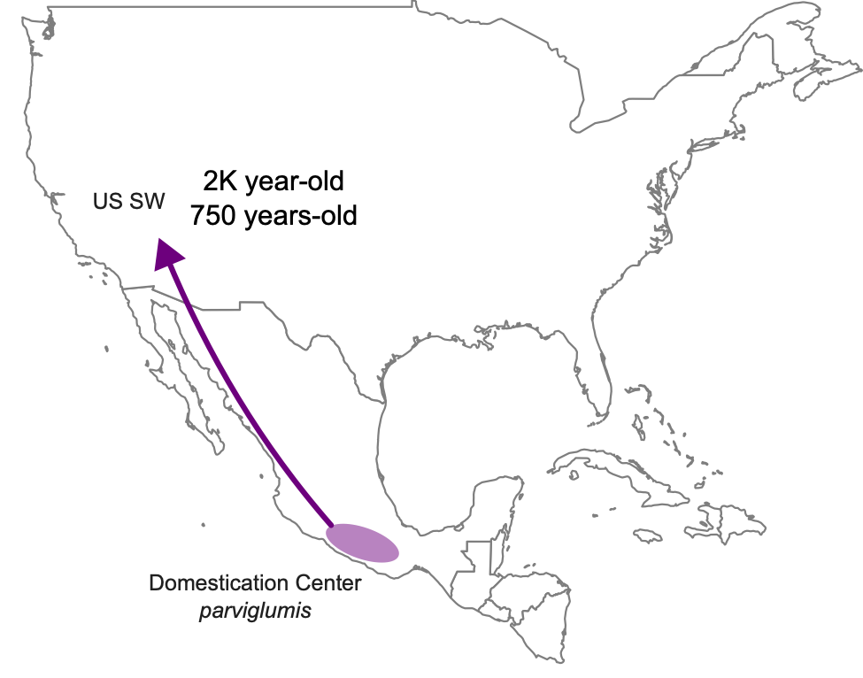

## Estimating selection on ancient maize

For this exercise, we will be working on a dataset that consists of ancient maize genomes and we use the Population branch statistic to look for selection.

### Interactive node

Start by getting an interactive node: 

```{bash, eval = FALSE}
# First log in to the server (remember to change ku_username for your username)
ssh ku_username@mjolnirgate.unicph.domain

# request one CPU using salloc like this:
salloc --partition=cpuqueue --nodes=1 -D `pwd` --mem-per-cpu 5250 --ntasks-per-node=1 -t 1000 --qos=teaching --reservation=aDNA_PHD_course --account=teaching

# once the job has been allocated, you can login to the node with srun like this:
srun --pty -n 1 -c 1 bash -i
```

Create a directory for this exercise:
```{bash, eval = FALSE}
# remember to change ku_username for your username:
username="ku_username"
mkdir -p /projects/course_1/people/${username}/Selection
cd /projects/course_1/people/${username}/Selection
```

### Estimating Tajima's D in the ancient US Southwest maize

For this exercise we will use ancient maize genomes from the Tularosa cave in the US Southwest (US SW) from the following populations:
- Ten 2,000 year-old genomes from the US SW
- Twelve 750 year-old genomes from the US SW 
- Sixteen modern genomes of wild maize ancestor (subsp. *parviglumis*)

How maize dispersed from the center of domestication in Mexico to the US SW:


We will be working with these three lists of genomes:
```
# We will be using the following lists of genomes: 
ls /projects/course_1/people/clx746/DataSelection/SW750.txt
ls /projects/course_1/people/clx746/DataSelection/SW2K.txt
ls /projects/course_1/people/clx746/DataSelection/parviglumis.txt
```

#### 1. Estimate Genotype-likelihoods (GL)
Now we can estimate GL using ANGSD -doSaf:

```
# load angsd
module load angsd/0.921

# parviglumis (we won't run this one, because it takes too long, we will copy it instead)
#angsd -bam /projects/course_1/people/clx746/DataSelection/parviglumis.txt -ref /projects/course_1/people/clx746/DataSelection/B73v3_25.fa -anc /projects/course_1/people/clx746/DataSelection/TDD39103.fa -out parviglumis_ds1 -doSaf 1 -C 50 -baq 1 -GL 2 -P 5 -minMapQ 30 -minQ 20 -minInd 6 -setMinDepth 3 -doCounts 1 
cp .

# sw2k
angsd -bam /projects/course_1/people/clx746/DataSelection/SW2K.txt -ref /projects/course_1/people/clx746/DataSelection/B73v3_25.fa -anc /projects/course_1/people/clx746/DataSelection/TDD39103.fa -out sw2k_ds1 -doSaf 1 -C 50 -baq 1 -GL 2 -P 10 -minMapQ 30 -minQ 20 -minInd 5 -setMinDepth 3 -doCounts 1

# sw750
angsd -bam /projects/course_1/people/clx746/DataSelection/SW750.txt -ref /projects/course_1/people/clx746/DataSelection/B73v3_25.fa -anc /projects/course_1/people/clx746/DataSelection/TDD39103.fa -out sw750_ds1 -doSaf 1 -C 50 -baq 1 -GL 2 -P 5 -minMapQ 30 -minQ 20 -minInd 5 -setMinDepth 3 -doCounts 1 
```

Check which parameters we are using and make sure they make sense to you.

#### 2. Estimate the 2D-SFS using realSFS

We will use realSFS to obtain an estimate of the SFS for domesticated maize. Note that we are providing realSFS the file that ends in .idx, which is the index for the GL that we generated before:

```
# run one at a time
realSFS sw2k_ds1.saf.idx sw750_ds1.saf.idx > sw2k_sw750.sfs
realSFS parviglumis_ds1.saf.idx sw2k_ds1.saf.idx  > parviglumis_sw2k.sfs
realSFS parviglumis_ds1.saf.idx sw750_ds1.saf.idx  > parviglumis_sw750.sfs
```

#### 3. create an index for the three populations

```
realSFS fst index parviglumis_ds1.saf.idx sw2k_ds1.saf.idx sw750_ds1.saf.idx -fstout parviglumis_sw2k_sw750 -whichFst 1 -sfs parviglumis_sw2k.sfs -sfs parviglumis_sw750.sfs -sfs sw2k_sw750.sfs
```

#### 4. Estimate FST an PBS

Estimate PBS and FST for a list of ~600 genes that have been associated with domestication traits. 

```
# improvement genes
cat /projects/course_1/people/clx746/DataSelection/Improvement_candidates_v3_sorted.txt |while read l; do gene=$(echo $l |cut -f 4 -d " "); chr=$(echo $l |cut -f 1 -d " "); s=$(echo $l |cut -f 2 -d " "); e=$(echo $l |cut -f 3 -d " "); /projects/symbean/people/clx746/Scripts/angsd/misc/realSFS fst stats parviglumis_sw2k_sw750.fst.idx -whichFst 1 -r ${chr}:${s}-${e} > pbs_${gene}.txt; done

# domestication genes:
cat /projects/course_1/people/clx746/DataSelection/DomesticationGenes_extended_v3_sorted.txt |while read l; do gene=$(echo $l |cut -f 5 -d " "); chr=$(echo $l |cut -f 1 -d " "); s=$(echo $l |cut -f 2 -d " "); e=$(echo $l |cut -f 3 -d " "); /projects/symbean/people/clx746/Scripts/angsd/misc/realSFS fst stats parviglumis_sw2k_sw750.fst.idx -whichFst 1 -r ${chr}:${s}-${e} > pbs_${gene}.txt; done
```

#### 6. Make a table with the summary of the results

We will first compile all the info in a single table:
```
R
# find all files
f<-dir(pattern="pbs_")

get the PBS for each gene:
gene<-NULL
pbs1<-NULL
pbs2<-NULL
pbs3<-NULL
for(i in f){
	a<-read.table(i, as.is=T)
	gene<-c(gene, gsub(".txt", "", gsub("pbs_", "", i)))
	pbs1<-c(pbs1, a[a[,1]=="pbs.pop1",2])
	pbs2<-c(pbs2, a[a[,1]=="pbs.pop2",2])
	pbs3<-c(pbs3, a[a[,1]=="pbs.pop3",2])
}

# write the results in a table
d<-data.frame(gene, pbs1, pbs2, pbs3)
write.table(d, quote=F, sep="\t", col.names=T, row.names=F, file="PBS_DomGenes.txt")
q("no")
```

#### 5. Plot the results

Discuss in groups which PBS you think might be interesting to plot and what the results mean. 

```
R
# example on how you can plot results for PBS1
# read table:
d<-read.table("PBS_DomGenes.txt", as.is=T, h=T)
d<-d[!(is.na(d$pbs1)),]
# example of how you can plot PBS1

# make a plot
pdf("PBS1.pdf", useDingbats=F, width=7.5, heigh=5)
plot(d$pbs1, ylab="PBS1")
text(seq(1:length(d$pbs1)), d$pbs1, d$gene, pos=2, cex=0.5)
dev.off()

q("no")
```

Which PBS did you plot?
What do the results tell you?
Did you find any interesting gene?


